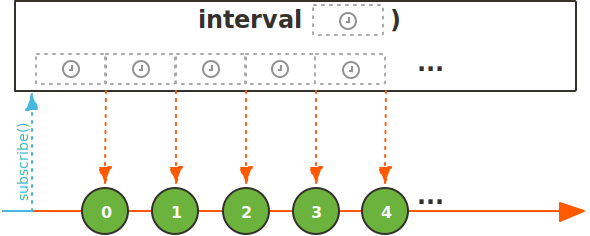
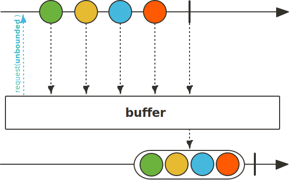

# 响应式编程概念

## 什么是响应式编程

响应式编程是一种面向**数据流**和变化传播的声明式的编程范式

重要概念: 数据流. 数据流可以是一个个需要处理的数据. 例如每笔交易的订单的数据, 也可以是一个个待响应的事件. 例如用户浏览网页时点击鼠标的操作

在编程语言中声明好了静态或者动态数据流之后, 就可以通过相关计算模型自动将变化的值通过数据流的逻辑进行传播. -> 这就是响应式编程

## 响应式编程特点

### 事件驱动

基于观察者设计模式


观察对象subject管理所有的依赖于它的观察者列表Observer, 当观察对象状态发生变化的时候会主动发出通知, 例如调用notifyObservers方法, 此时他会遍历所有注册在上面的观察者列表, 对每一个观察者调用concrete.notify方法通知观察者你所关注的对象的状态发生了变化.

系统中有多种事件, 例如连接db, 接受http请求等. 响应式编程的愿景就是**完全的事件驱动**. 从第一个事件被触发开始依次按照声明好的事件传播链路来处理. 后续的读取和返回都是对第一个事件的响应. -> 完全响应式的框架

### 异步代码编排

以往的java中使用callback回调函数的形式, 问题: 可能过于冗长. 


逻辑: 读MQ -> post请求 -> 查找数据库 -> 写MQ

多层嵌套回调函数, 为了避免这种冗余的回调, 在响应式中可以这么实现


也可以使用jdk8中的CompletableFuture也可以实现, 但是对于复杂逻辑处理不够理想. -> 响应式提供丰富的操作符简化异步逻辑编排

## 响应式流JVM规范

https://github.com/reactive-streams/reactive-streams-jvm

NetFlix – RxJava, Pivotal – Reactor, RedHat – Vert.x

* 处理任意数量的元素 -> 可以处理无限元素的数据流. 天气, 时钟
* 按序处理
* 异步传递元素. 发送之后当前线程立即返回
* 非阻塞的**回压**. 强制要求缓冲区大小必须有上限, 并且由订阅者控制. -> 处理无限量元素的时候不会因为发送元素过多or过快造成内存等资源的枯竭

各个框架都有自己的回压策略

例如project reactor中的回压策略:

* Missing. 没有策略, 下游应收尽收. 不建议使用
* Error. 下游跟不上上游的节奏, 上游抛出错误
* Buffer(默认策略). 下游没来得及处理的元素先存在缓存中. -> 如果不设置缓存大小可能错误
* Drop. 下游没有准备好, 就会直接抛弃
* Latest. 下游只会得到上游最新的元素

# 响应式编程接口类

Publisher(发布者), Subscriber(订阅者), Subscription(订阅), Processor(处理过程)

## Publisher

Publisher(发布者)提供任意数量的元素序列. 接收到Subscriber(订阅者)发出的订阅后会根据订阅者的需求逐次调用下面的方法来进行事件传播.

onSubscribe; onNext*n; (onError|onComplete)?可选

其中注意: 

* onSubscriber肯定被调用1次, 
* 然后是0~n次的onNext, 
* 最后是onError或者onComplete结束订阅流程. 
* 订阅者主动取消当前订阅时, 可以不需要onError|onComplete, 不会再发送数据


```java
public interface Publisher<T> {
    public void subscribe(Subscriber<? super T> s);
}
```

只有一个subscribe方法, 可以通过该方法来指定一个Subscriber(订阅者)来订阅.

规则:

* **Publisher向Subscriber发送onNext信号次数(调用onNext数量)不得超过订阅者请求的元素个数. 即如果请求3个元素不可以发送超过3个元素.** -> 基础重要的原则, 保证了接受元素的先后顺序.

* 如果publisher失败, 需要调用onError告知订阅者. -> 订阅者有时间做错误处理, 资源清理等
* Publisher.subscribe()内部必须调用onSubscribe(Subscriber s). onSubscribe通知订阅者该订阅已开始 -> 为了让Subscriber做好初始化, 开始准备接受后续元素.
* **当前的Publisher允许同时存在多个Subscriber**, 一个元素序列可以由一个发布者同时向多个订阅者进行发送, 类似广播 -> Publisher和Subscriber的关系: 1对n

## Subscriber

```java
public interface Subscriber<T> {
    /**
     * Invoked after calling {@link Publisher#subscribe(Subscriber)}.
     * <p>
     * No data will start flowing until {@link Subscription#request(long)} is invoked.
     * <p>
     * It is the responsibility of this {@link Subscriber} instance to call {@link Subscription#request(long)} whenever more data is wanted.
     * <p>
     * The {@link Publisher} will send notifications only in response to {@link Subscription#request(long)}.
     * 
     * @param s
     *            {@link Subscription} that allows requesting data via {@link Subscription#request(long)}
     */
    public void onSubscribe(Subscription s);

    /**
     * Data notification sent by the {@link Publisher} in response to requests to {@link Subscription#request(long)}.
     * 
     * @param t the element signaled
     */
    public void onNext(T t);

    /**
     * Failed terminal state.
     * <p>
     * No further events will be sent even if {@link Subscription#request(long)} is invoked again.
     *
     * @param t the throwable signaled
     */
    public void onError(Throwable t);

    /**
     * Successful terminal state.
     * <p>
     * No further events will be sent even if {@link Subscription#request(long)} is invoked again.
     */
    public void onComplete();
}

```

onSubscribe, onNext, onError, onComplete

规则: 

* **为了收到onNext发送的信号, 订阅者必须调用Subscriptions.request(long n)**来向发布者请求数据
  * 为了让订阅者决定什么时候和如何来处理上游传下来的元素, 确保他有足够的资源来进行处理.
  * 规范推荐在力所能及的范围内, 每次请求尽可能多的元素. 相比较每次请求一个元素会更加有效率.
* Subscriber的onComplete和onError, 不能够调用subscription或者是publisher上的任何方法
  * 为了防止在处理这两个终结信号的操作的时候, publisher和他们如果是在不同的线程上执行, 可能会出现一些静态条件
* 如果当前的subscriber有活跃的订阅, 如果在接收了另外一个订阅上下文传送的onSubscribe方法时, 必须要去调用subscription.cancel来取消另外一个订阅
  * 保证的订阅者不会同时与多个发布者发生交互, 如果不这么做, 可能因为资源泄露而产生一些稀奇古怪的bug.
* 即使订阅者已经调用subscription.cancel取消了当前的这个订阅, 仍有可能有onNext信号发送, 仍需做好准备
  * 因为调用cancel方法时, 发布者并没有保证他会立即执行, 可能发布者在真正的去处理这个取消订阅的操作之前依然会向下游去发送一些元素. 此时subscriber需要处理这些元素.

## Subscription


```java
public interface Subscription {
    /**
     * No events will be sent by a {@link Publisher} until demand is signaled via this method.
     * <p>
     *  It can be called however often and whenever needed—but if the outstanding cumulative demand ever becomes Long.MAX_VALUE or more,
     *  it may be treated by the {@link Publisher} as "effectively unbounded".
     * <p>
     * Whatever has been requested can be sent by the {@link Publisher} so only signal demand for what can be safely handled.
     * <p>
     * A {@link Publisher} can send less than is requested if the stream ends but
     * then must emit either {@link Subscriber#onError(Throwable)} or {@link Subscriber#onComplete()}.
     * 
     * @param n the strictly positive number of elements to requests to the upstream {@link Publisher}
     */
    public void request(long n);

    /**
     * Request the {@link Publisher} to stop sending data and clean up resources.
     * <p>
     * Data may still be sent to meet previously signalled demand after calling cancel.
     */
    public void cancel();
}

```

request(long): 去请求n个元素

cancel(): 去取消这个订阅

Subscription: 表述当前发布者和订阅者之间的订阅关系的一个对象, 他会在调用Subscriber定义的onSubscribe的方法的时候传递给订阅者, 这样订阅者就获得了当前publisher和当前的这个活跃订阅的一个关联关系.

规则:

* request和cancel都必须在当前subscribe的上下文当中被调用, 确保发布者和订阅者关系的唯一性. 
* subscription.request(long)最多请求2^63-1个元素, Java中long长整型的max_value. 基本可以把它看作是无限多个元素序列
  * 如果每一纳秒发送一个元素, 如果要发送这么多元素的话需要292年.

## Processor

Processor代表处理的状态, 既是Publisher又是Subscriber

```java
/**
 * A Processor represents a processing stage—which is both a {@link Subscriber}
 * and a {@link Publisher} and obeys the contracts of both.
 *
 * @param <T> the type of element signaled to the {@link Subscriber}
 * @param <R> the type of element signaled by the {@link Publisher}
 */
public interface Processor<T, R> extends Subscriber<T>, Publisher<R> {
}
```

知道他的存在就可以了, 因为reactor框架在3.5版本之后就已经作废了processor的一些实现类, 例如MonoProcessor和FluxProcessor, 转而使用Since?

# project Reactor

## 简介

* 对响应式流规范的一种实现
* Spring WebFlux默认的响应式框架

* 完全异步非阻塞, 支持背压
  * 在处理无限个元素时, 能够根据订阅者的消费速度来进行调节

* 提供两个异步序列API: Flux[N]和Mono[0|1]
  * Flux: 类比有很多元素组成的列表或者是数组.
  * Mono: 类比相当于一个optional的类, 可以返回一个empty, 也可以返回一个唯一的一个值
  * 例子: 一个HTTP请求只会产生一个回复. -> 应该表示成Mono更加贴切

* 提供对响应式流的操作
  * reactive stream, 注意区分jdk8中的stream. 包括选择, 过滤, 转换, 合并等

## Flux和Mono

### Flux


* Flux是一个标准的Publisher实现, 代表产生0到n个元素的异步序列. 
* 这个序列可以被completion或error信号来终结. 对应到响应式流就是Subscriber上的onNext, onComplete和onError这三个方法. **这三个事件信号甚至包括结束信号其实都是可选**, 所以Flux用途也因此多种多样
  * 如果我们不要用onNext, 但是就用了complete, 我们就得到了一个空的有限序列.
  * 甚至连onComplete也不调用, 就拿到了一个空的无限序列. -> 更多用来做测试. 
  * 更多情况下无限序列不会是空的, 例如: `Flux.interval(Duration) -> Flux<Long>`. 产生`Flux<long>`类型的无限序列, 按照设置的duration时钟按时产生元素

### Mono


Mono也是Publisher实现, 产生至多一个元素的异步序列, 然后通过调onComplete信号来结束整个调用

注意:

**在Mono中, 如果已经调用onNext的话, 不能够再去调用onError的, 只能二选一**(reactor框架的限制)

如果已经调用了onNext, 那么不管mono有没有返回值, 他是调用成功了. 如果这个时候再去调用onError的方法, 那么这个mono的状态到底是成功还是失败就没有办法确定了

## 流的创建

* 项目依赖
* 创建流的工厂方法实例和注意事项

### pom依赖

```xml
<dependency>
    <groupId>io.projectreactor</groupId>
    <artifactId>reactor-core</artifactId>
    <version>3.3.18.RELEASE</version>
</dependency>
<dependency>
    <groupId>io.projectreactor</groupId>
    <artifactId>reactor-test</artifactId>
    <version>3.3.18.RELEASE</version>
</dependency>

<dependency>
    <groupId>org.junit.jupiter</groupId>
    <artifactId>junit-jupiter-api</artifactId>
    <version>5.7.2</version>
    <scope>test</scope>
</dependency>

<dependency>
    <groupId>org.projectlombok</groupId>
    <artifactId>lombok</artifactId>
    <version>1.18.20</version>
</dependency>
<dependency>
    <groupId>org.slf4j</groupId>
    <artifactId>slf4j-api</artifactId>
    <version>1.7.30</version>
</dependency>
<dependency>
    <groupId>ch.qos.logback</groupId>
    <artifactId>logback-core</artifactId>
    <version>1.2.3</version>
</dependency>
<dependency>
    <groupId>ch.qos.logback</groupId>
    <artifactId>logback-classic</artifactId>
    <version>1.2.3</version>
</dependency>
```

关于流的创建, 拿股价的订阅系统为例, 生成一个股票代码的流. 首先需要考虑是使用Flux还是Mono, 因为不止一只股票, 所以要使用Flux来创建, 代表多余一个元素的序列.

### Flux.just


Create a `Flux` that emits the provided elements and then completes.

只要把所有的元素全部扔进去, 然后他就可以生成一个序列

```java
public void fluxJust() {
    Flux<String> stockSequence1 = Flux.just("APPL", "AMZN", "TSLA");
}
```

### Flux.fromIterable


Create a [`Flux`](https://projectreactor.io/docs/core/release/api/reactor/core/publisher/Flux.html) that emits the items contained in the provided [`Iterable`](https://docs.oracle.com/javase/8/docs/api/java/lang/Iterable.html?is-external=true). The [`Iterable.iterator()`](https://docs.oracle.com/javase/8/docs/api/java/lang/Iterable.html?is-external=true#iterator--) method will be invoked at least once and at most twice for each subscriber.

从实现的Java的Iterable interface的一些类, 链表之类创建流

```java
public void fluxFromIterable() {
    Flux<String> stockSeq2 = Flux.fromIterable(Arrays.asList("APPL", "AMZN", "TSLA"));
}
```

### Flux.fromArray


Create a [`Flux`](https://projectreactor.io/docs/core/release/api/reactor/core/publisher/Flux.html) that emits the items contained in the provided array.

```java
public void fluxFromArray() {
    Flux<String> stockSeq3 = Flux.fromArray(new String[]{"APPL", "AMZN", "TSLA"});
}
```

### Flux.fromStream

 Create a [`Flux`](https://projectreactor.io/docs/core/release/api/reactor/core/publisher/Flux.html) tha t emits the items contained in the provided [`Stream`](https://docs.oracle.com/javase/8/docs/api/java/util/stream/Stream.html?is-external=true). Keep in mind that a [`Stream`](https://docs.oracle.com/javase/8/docs/api/java/util/stream/Stream.html?is-external=true) **cannot be re-used**, which can be problematic in case of multiple subscriptions or re-subscription (like with [`repeat()`](https://projectreactor.io/docs/core/release/api/reactor/core/publisher/Flux.html#repeat--) or [`retry()`](https://projectreactor.io/docs/core/release/api/reactor/core/publisher/Flux.html#retry--)). The [`Stream`](https://docs.oracle.com/javase/8/docs/api/java/util/stream/Stream.html?is-external=true) is [`closed`](https://docs.oracle.com/javase/8/docs/api/java/util/stream/BaseStream.html?is-external=true#close--) automatically by the operator on cancellation, error or completion.

务必注意, 此处的Stream不可以被重复使用. 就是说如果已经对这个序列已经订阅了一遍, 如果再去订阅第二遍的时候是会有问题的. 因为对于jdk8的来说, Stream它只能被打开一次, 如果他已经被操作过之后, Stream会被关闭, 所以当你再去操作第二遍的时候, 他就会抛出来一个错误.

```java
@Test
public void fluxFromStream() {
    Flux<String> stockSeq4 = Flux.fromStream(Stream.of(new String[]{"APPL", "AMZN", "TSLA"}));
    stockSeq4.subscribe();
    stockSeq4.subscribe(); //can only subscribe once! will throw error
}
```

运行后抛出错误

```
reactor.core.Exceptions$ErrorCallbackNotImplemented: java.lang.IllegalStateException: stream has already been operated upon or closed
Caused by: java.lang.IllegalStateException: stream has already been operated upon or closed
```

### Flux.empty


Create a [`Flux`](https://projectreactor.io/docs/core/release/api/reactor/core/publisher/Flux.html) that completes without emitting any item.

返回一个空序列

```java
public void fluxEmpty() {
    Flux<String> stockSeq5 = Flux.empty(); //generic type still honored
}
```

返回的是一个空的一个序列, 但是因为这边已经定义了一个泛型String, 他依然是能够尊重我们这个约束, 返回一个String泛型的序列.

### Flux.range


Build a Flux that will only emit a sequence of count incrementing integers, starting from start. That is, emit integers between **start (included) and start + count (excluded)** then complete.

```java
public void fluxRange() {
    // 5, 6, 7
    Flux<Integer> numbers = Flux.range(5, 3);
}
```

(起始值, 数量)

### Flux.generate


Programmatically create a Flux by generating signals one-by-one via a consumer callback.

```java
public void fluxGenerate() {
    //synchronous, one-by-one
    Flux<Long> flux = Flux.generate(
        AtomicLong::new,
        (state, sink) -> {
            long i = state.getAndIncrement();
            // sink序列号发送出去
            sink.next(i);
            if (i == 10) sink.complete();
            return state;
        },
        // 可以把数据库连接关闭等操作放在这里
        (state) -> System.out.println("I'm done")
    );
    flux.subscribe(System.out::println);
}
```

* 同步的方法, 并且每次generate只能有一个信号发送的操作
  * 意味着在每次的generate里面不能调用多余一次的next方法, (因为一个next就是一个信号的发送), 否则它就会报错
* 有一个state来让你去根据当前的状态来决定下一个发送的元素是什么

源代码:

```java
public static <T, S> Flux<T> generate(Callable<S> stateSupplier, BiFunction<S, SynchronousSink<T>, S> generator, Consumer<? super S> stateConsumer) {
    return onAssembly(new FluxGenerate<>(stateSupplier, generator, stateConsumer));
}
```

* stateSupplier: 初始化. 示例中是序列号生成器Flux写法. called for each incoming Subscriber to provide the initial state for the generator bifunction

* generator: Consume the SynchronousSink provided per-subscriber by Reactor as well as the current state to generate a single signal on each pass and return a (new) state.

* stateConsumer: 可以把数据库连接关闭等操作放在这里. called after the generator has terminated or the downstream cancelled, receiving the last state to be handled (i.e., release resources or do other cleanup).

 ### Flux.create


Programmatically create a [`Flux`](https://projectreactor.io/docs/core/release/api/reactor/core/publisher/Flux.html) with the capability of **emitting multiple elements** in a **synchronous or asynchronous** manner through the [`FluxSink`](https://projectreactor.io/docs/core/release/api/reactor/core/publisher/FluxSink.html) API. This includes emitting elements from multiple threads.

* 相比较Flux.generate是异步的操作, 可以有多于一个next方法的回调
* 不像Flux.generate, 没有state
* 一般的用途是把其他的一些异步的API, 比如说一些listener集成到reactor框架里面

```java
Flux<String> stockSeq6 = Flux.create((t) -> {
    t.next("APPL");
    t.next("AMZN");
    t.complete();
});
// 更有意义的例子
Flux<String> stockSeq7 = Flux.create(sink -> {
    //pretend we are registering a listener here
    new MyDataListener() {
        public void onReceiveData(String str) {
            sink.next(str);
        }

        public void onComplete() {
            sink.complete();
        }
    };// 下游背压策略
}, FluxSink.OverflowStrategy.DROP);

public class MyDataListener {
    public void onReceiveData(String str) {
        //do something
    }

    public void onComplete() {
        //do something
    }
}
```

MyDataListener中两个回调, onReveiceData和onComplete, 

```java
public static <T> Flux<T> create(Consumer<? super FluxSink<T>> emitter, OverflowStrategy backpressure) {
    return onAssembly(new FluxCreate<>(emitter, backpressure, FluxCreate.CreateMode.PUSH_PULL));
}
```

This Flux factory is useful if one wants to adapt some other multi-valued async API and not worry about cancellation and backpressure (which is handled by buffering all signals if the downstream can't keep up).

emitter: Consume the {@link FluxSink} provided per-subscriber by Reactor to generate signals.

backpressure: 背压策略

背压策略如下:

```java
enum OverflowStrategy {
    /**
* Completely ignore downstream backpressure requests.
* <p>
* This may yield {@link IllegalStateException} when queues get full downstream.
*/
    IGNORE,
    /**
* Signal an {@link IllegalStateException} when the downstream can't keep up
*/
    ERROR,
    /**
* Drop the incoming signal if the downstream is not ready to receive it.
*/
    DROP,
    /**
* Downstream will get only the latest signals from upstream.
*/
    LATEST,
    /**
* Buffer all signals if the downstream can't keep up.
* <p>
* Warning! This does unbounded buffering and may lead to {@link OutOfMemoryError}.
*/
    BUFFER
}
```

IGNORE: 忽略背压, 都给下游, 崩掉算了

ERROR: 下游消费过慢, 抛出error

DROP: 下游消费过慢, drop掉, 不发送给下游

LATEST: 下游只会拿到上游最新的信号

BUFFER: 默认策略, 下游消费过慢会放到缓存, 注意是无限增长, 可能oom

### Flux.defer


Lazily supply a [`Publisher`](https://www.reactive-streams.org/reactive-streams-1.0.3-javadoc/org/reactivestreams/Publisher.html?is-external=true) every time a [`Subscription`](https://www.reactive-streams.org/reactive-streams-1.0.3-javadoc/org/reactivestreams/Subscription.html?is-external=true) is made on the resulting [`Flux`](https://projectreactor.io/docs/core/release/api/reactor/core/publisher/Flux.html), so the actual source instantiation is deferred until each subscribe and the [`Supplier`](https://docs.oracle.com/javase/8/docs/api/java/util/function/Supplier.html?is-external=true) can create a subscriber-specific instance. If the supplier doesn't generate a new instance however, this operator will effectively behave like [`from(Publisher)`](https://projectreactor.io/docs/core/release/api/reactor/core/publisher/Flux.html#from-org.reactivestreams.Publisher-).

直到一个订阅Subscription生成之后才会懒加载(Lazily supply)一个publisher, 换句话说就是这个源的实例化会被推迟到subscriber方法调用之后, 并且只有在这个时候, 他才会通过调用我们给的suppler方法(在这边就是我们一个lambda定义的`() -> Flux.just("APPL", "AMZN", "TSLA")`)对每一个subscriber都有每一个数据源

```java
public void fluxDefer() {
    Flux.defer(() -> Flux.just("APPL", "AMZN", "TSLA"))
        .subscribe(System.out::println);

    //due to the nature of defer, fromStream will not throw exception now
    Flux<String> stockSeq4 = Flux.defer(() -> Flux.fromStream(Stream.of(new String[]{"APPL", "AMZN", "TSLA"})));
    stockSeq4.subscribe();
    stockSeq4.subscribe();
}

// 之前报错的例子
public void fluxFromStream() {
    Flux<String> stockSeq4 = Flux.fromStream(Stream.of(new String[]{"APPL", "AMZN", "TSLA"}));
    stockSeq4.subscribe();
    stockSeq4.subscribe(); //can only subscribe once! will throw error
}
```

在之前在`Flux.fromStream`里面去生成的时候去重复订阅多次(多次subscribe())的话, 会抛一个异常. 如果这个时候我在外面去包了一层`Flux.defer`推迟操作的话, 那后面再去订阅的时候, 就不会报错了

* 因为两次subscribe, 他每一次都会要用这个supply方法, 从而生成一个新的flux. 所以也就是说其实我这两个Subscriber订阅的流并不是一个, 而是每次通过supplier的方法独立调用出来的一个flux. 所以这个时候如果订阅两遍就没有问题了.

```java
public static <T> Flux<T> defer(Supplier<? extends Publisher<T>> supplier) {
   return onAssembly(new FluxDefer<>(supplier));
}
```

supplier: supplier – the Publisher Supplier to call on subscribe

### Flux.interval



Create a [`Flux`](https://projectreactor.io/docs/core/release/api/reactor/core/publisher/Flux.html) that emits long values starting with 0 and incrementing at specified time intervals on the global timer. The first element is emitted after an initial delay equal to the `period`. If demand is not produced in time, an onError will be signalled with an [`overflow`](https://projectreactor.io/docs/core/release/api/reactor/core/Exceptions.html#isOverflow-java.lang.Throwable-) `IllegalStateException` detailing the tick that couldn't be emitted. In normal conditions, the [`Flux`](https://projectreactor.io/docs/core/release/api/reactor/core/publisher/Flux.html) will never complete.

Runs on the [`Schedulers.parallel()`](https://projectreactor.io/docs/core/release/api/reactor/core/scheduler/Schedulers.html#parallel--) Scheduler.

定义一个Duration, 然后会按照这个时间间隔按时发送元素.

这里用`Thread.sleep`避免测试方法过早退出. 主线程睡眠, 让子线程log. 所以最多log到10s

```java
Flux.interval(Duration.of(1, ChronoUnit.SECONDS))
    .subscribe((t) -> log.info(String.valueOf(t)));
log.info("Going to pause test thread, so that we don't end the test method before flux emits");
Thread.sleep(10000);
```

运行结果

```
20:13:02.990 [main] DEBUG reactor.util.Loggers - Using Slf4j logging framework
20:13:03.010 [main] INFO ReactorStreamCreateTest - Going to pause test thread, so that we don't end the test method before flux emits
20:13:04.026 [parallel-1] INFO ReactorStreamCreateTest - 0
20:13:05.016 [parallel-1] INFO ReactorStreamCreateTest - 1
20:13:06.014 [parallel-1] INFO ReactorStreamCreateTest - 2
20:13:07.011 [parallel-1] INFO ReactorStreamCreateTest - 3
```

每隔一秒钟吐出一个元素, 然后通过log方法去把它打印出来

注意:

这里面的subscribe方法所运行的线程是parallel-1.

然后这个测试方法(就是打log的这个`log.info`)是我们的主线程. 

从这里可以大概看到整个reactor就是一个默认异步非阻塞的实现. 他的subscribe方法都会在另外一个单独的线程里面去跑

具体reactor框架中的线程模型. 留到后面再来讲. -> 

## 流的操作

上一节创建了响应式流, 这一小节说如何操作这些流

### 订阅

Reactor框架中提供几种流订阅方法

#### subscribe

最基本的操作, 不会打印任何东西, 只会去触发流的生产过程.

log函数是Flux提供的一个方法, 用来代码调试和帮助我们理解reactor内部做了哪些事情

```java
public void subscribeMethod() {
    Flux<String> stockSeq1 = Flux.just("APPL", "AMZN", "TSLA");
    stockSeq1.log().subscribe();
}
```

运行后日志:

```
15:22:30.714 [main] INFO reactor.Flux.Array.1 - | onSubscribe([Synchronous Fuseable] FluxArray.ArraySubscription)
15:22:30.719 [main] INFO reactor.Flux.Array.1 - | request(unbounded)
15:22:30.719 [main] INFO reactor.Flux.Array.1 - | onNext(APPL)
15:22:30.719 [main] INFO reactor.Flux.Array.1 - | onNext(AMZN)
15:22:30.719 [main] INFO reactor.Flux.Array.1 - | onNext(TSLA)
15:22:30.721 [main] INFO reactor.Flux.Array.1 - | onComplete()
```

1. onSubscribe([Synchronous Fuseable] FluxArray.ArraySubscription): 调用onSubscribe方法生成了ArraySubscription
2. request(unbounded): 在subscription中, 订阅者去请求了无限多个元素. 就是告诉flux(也就是发布者)有多少的元素请全部发送给我
3. onNext(..): 发布者Publisher接收到这个请求之后, 会依次调用onNext将元素发送给下游. 3,4,5行
4. onComplete: 当整个元素发送结束之后, Publisher调用onComplete去结束这个发布, 就是告诉订阅者, 你的这一次订阅已经结束了. 如果中间有错误的话, 那么他就会在这里调用onError, 也会结束整个发送的过程.

总结: 

* 一次调用request请求无限多个元素
* 多次调用onNext向订阅者发送元素
* 最后的调用onComplete结束整个流程

#### errorConsumer

```java
public void subscribeWithErrorConsumer() {
    Flux<Integer> ints = Flux.range(1, 4)
        .map(i -> {
            if (i <= 3) return i;
            throw new RuntimeException("i>3");
        });
    
    ints.subscribe(
        i -> log.info(String.valueOf(i)),
        err -> log.error("error: {}", err.getMessage())
    );
}
```

1. 首先定义一个会抛出异常的响应式的流. `Flux.range(1, 4)`, 如果小于3正常发送, 大于3抛出异常

2. 然后`ints.subscribe` 这个订阅方法用两个lambda来定义了消费者, 
   * 第一个消费者是正常的元素消费, 简单的打印日志
   * 第二个消费者错误消费者, 通过第一个参数可以拿到这个错误的信息(Throwable格式), 因为上面会抛出exception, 就可以在这里查看他的错误信息以及做一些其他的操作

运行结果:

```
15:35:47.327 [main] INFO ReactorStreamSubscribeTest - 1
15:35:47.327 [main] INFO ReactorStreamSubscribeTest - 2
15:35:47.327 [main] INFO ReactorStreamSubscribeTest - 3
15:35:47.335 [main] ERROR ReactorStreamSubscribeTest - error: i>3
```

可以看到1,2,3是正常的打印. 当打印第四个元素的时候, 因为抛出的异常, 所以相应的在这边它会记录下来这个异常

#### completeConsumer

```java
public void subscribeWithErrorConsumerAndCompleteConsumer() {
    Flux<Integer> ints = Flux.range(1, 4)
        .map(i -> {
            if (i <= 3) return i;
            throw new RuntimeException("i>3");
        });
    ints.subscribe(
        i -> log.info(String.valueOf(i)),
        err -> log.error("error: {}", err.getMessage()),
        () -> log.info("Subscription completed")
    ); //errorConsumer and complete consumer are mutually exclusive
}
```

运行结果

```
15:44:51.865 [main] INFO ReactorStreamSubscribeTest - 1
15:44:51.865 [main] INFO ReactorStreamSubscribeTest - 2
15:44:51.865 [main] INFO ReactorStreamSubscribeTest - 3
15:44:51.870 [main] ERROR ReactorStreamSubscribeTest - error: i>3
```

相比较又多了一个consumer, 当整个订阅成功完成就会去运行, 一般用途是去通知其他的一些服务, 表示订阅已经完成了.

注意: errorConsumer and complete consumer are mutually exclusive

**ErrorConsumer和completeConsumer不能够同时去被触发**, 作为一个flux来说, 要么去调用onComplete或者是onError来结束, 不能两个同时调用. 相对的当调用了onComplete就会触发CompleteComsumer, onError就会触发ErrorComsumer. 他们两个是不会同时出现在你的运行的时候. 

可以写在一起, 只是不会同时触发.

例如: 

屏蔽掉error的, 改成null. 运行结果

```
15:43:26.222 [main] INFO ReactorStreamSubscribeTest - 1
15:43:26.222 [main] INFO ReactorStreamSubscribeTest - 2
15:43:26.222 [main] INFO ReactorStreamSubscribeTest - 3
15:43:26.236 [main] ERROR reactor.core.publisher.Operators - Operator called default onErrorDropped
reactor.core.Exceptions$ErrorCallbackNotImplemented: java.lang.RuntimeException: i>3
Caused by: java.lang.RuntimeException: i>3
```

#### subscriptionComsumer

```java
Flux<Integer> ints = Flux.range(1, 4);
Consumer<? super Subscription> subscriptionConsumer1 = null;
Consumer<? super Subscription> subscriptionConsumer2 = sub -> sub.request(3);
Consumer<? super Subscription> subscriptionConsumer3 = sub -> sub.request(5);
Consumer<? super Subscription> subscriptionConsumer4 = sub -> sub.cancel();
Consumer<? super Subscription> subscriptionConsumer5 = sub -> sub.getClass();

ints.log().subscribe(i -> log.info(String.valueOf(i)),
                     null,
                     () -> log.info("Subscription completed"),
                     subscriptionConsumer1
                    );
```

又多了一个subscriptionComsumer的lambda表达式, 有各种不同的况, 这里分类讨论一下:

1. null

就相当于没有传, 和之前一样. 在这个时候reactor框架会默认帮我们去请求所有的元素, 此时flux就会返回所有的1234并且打印出来

结果是

```
16:51:32.734 [main] INFO reactor.Flux.Range.1 - | onSubscribe([Synchronous Fuseable] FluxRange.RangeSubscription)
16:51:32.737 [main] INFO reactor.Flux.Range.1 - | request(unbounded)
16:51:32.737 [main] INFO reactor.Flux.Range.1 - | onNext(1)
16:51:32.738 [main] INFO ReactorStreamSubscribeTest - 1
16:51:32.738 [main] INFO reactor.Flux.Range.1 - | onNext(2)
16:51:32.738 [main] INFO ReactorStreamSubscribeTest - 2
16:51:32.738 [main] INFO reactor.Flux.Range.1 - | onNext(3)
16:51:32.738 [main] INFO ReactorStreamSubscribeTest - 3
16:51:32.738 [main] INFO reactor.Flux.Range.1 - | onNext(4)
16:51:32.738 [main] INFO ReactorStreamSubscribeTest - 4
16:51:32.738 [main] INFO reactor.Flux.Range.1 - | onComplete()
16:51:32.739 [main] INFO ReactorStreamSubscribeTest - Subscription completed
```

2. 请求的元素数量少于flux中的元素. sub.request(3)

```
16:52:38.212 [main] INFO reactor.Flux.Range.1 - | onSubscribe([Synchronous Fuseable] FluxRange.RangeSubscription)
16:52:38.215 [main] INFO reactor.Flux.Range.1 - | request(3)
16:52:38.215 [main] INFO reactor.Flux.Range.1 - | onNext(1)
16:52:38.215 [main] INFO ReactorStreamSubscribeTest - 1
16:52:38.215 [main] INFO reactor.Flux.Range.1 - | onNext(2)
16:52:38.215 [main] INFO ReactorStreamSubscribeTest - 2
16:52:38.215 [main] INFO reactor.Flux.Range.1 - | onNext(3)
16:52:38.215 [main] INFO ReactorStreamSubscribeTest - 3
```

此时我的订阅就会只返回我请求的这三个元素, 也就是1, 2, 3

3. 请求的元素数量多于flux中的元素. sub.request(5)

```
16:55:54.097 [main] INFO reactor.Flux.Range.1 - | onSubscribe([Synchronous Fuseable] FluxRange.RangeSubscription)
16:55:54.100 [main] INFO reactor.Flux.Range.1 - | request(5)
16:55:54.100 [main] INFO reactor.Flux.Range.1 - | onNext(1)
16:55:54.100 [main] INFO ReactorStreamSubscribeTest - 1
16:55:54.100 [main] INFO reactor.Flux.Range.1 - | onNext(2)
16:55:54.100 [main] INFO ReactorStreamSubscribeTest - 2
16:55:54.100 [main] INFO reactor.Flux.Range.1 - | onNext(3)
16:55:54.100 [main] INFO ReactorStreamSubscribeTest - 3
16:55:54.100 [main] INFO reactor.Flux.Range.1 - | onNext(4)
16:55:54.100 [main] INFO ReactorStreamSubscribeTest - 4
16:55:54.100 [main] INFO reactor.Flux.Range.1 - | onComplete()
16:55:54.100 [main] INFO ReactorStreamSubscribeTest - Subscription completed
```

这个请求会在Flux返回他所有的元素, 也就是1到4之后直接结束掉. 他并不会去等着那个第五个不存在的元素去返回回来,他会在返回所有的之后结束掉整个的发送,

4. sub.cancel(). 订阅一开始就取消

```
17:02:23.241 [main] INFO reactor.Flux.Range.1 - | onSubscribe([Synchronous Fuseable] FluxRange.RangeSubscription)
17:02:23.243 [main] INFO reactor.Flux.Range.1 - | cancel()
```

这个时候Flux不会发给我们任何元素

5. 没有向上游Publisher发送任何请求. 例如:sub.getClass()

```
17:04:03.376 [main] INFO reactor.Flux.Range.1 - | onSubscribe([Synchronous Fuseable] FluxRange.RangeSubscription)
Process finished with exit code 0
```

没有向上游这个发送任何请求, 没有request, 没有cancel. -> Flux永远不会结束(这里结束是因为使用的Test结束了, 而并不是说flux是运行完成了)

#### BaseSubscriber

比使用lambda来定义一些consumer, 更加复杂一些, 但是功能会更强的一个订阅方法, 使用框架提供的BaseSubscriber来订阅

Reactor框架推荐通过继承BaseSubscriber来实现自己的Subscriber, 如下

```java
public void subscribeWithBaseSubscriber() {
    Flux<Integer> ints = Flux.range(1, 4);
    ints.subscribe(new SampleSubscriber<>());
}
public class SampleSubscriber<T> extends BaseSubscriber<T> {
    @Overrid
    public void hookOnSubscribe(Subscription subscription) {
        log.info("Subscribed");
        request(1);
    }

    @Override
    public void hookOnNext(T value) {
        log.info(value.toString());
        request(1);
    }
}
```

BaseSubscriber中源代码, hookonSubscribe把所有元素一次性请求出来, 处理起来就相当于是一个没有被压的, 相当于跟我的发布者说你有多少元素请你通通发给我. -> 这个在某些业务场景里面是有问题的

```java
protected void hookOnSubscribe(Subscription subscription){
    subscription.request(Long.MAX_VALUE);
}
```

可以看到代码中写了一个最基础的背压, 首先在创建了subscription之后就是这个调用了hookOnSubscribe的方法, 只请求了一个元素. 然后等到发送者发送给我这个元素之后(hookOnNext), 把它打印出来, 相当于这边就做了一个处理, 并且再请求下一个元素. 

这样的话就相当于说由我们自己写的这个SampleSubscriber来控制我们消费的速度. 而不是一股脑的说元素全部发送给我, 然后再调用我的onNext做处理, 这样子很可能出现问题

此外的话, BaseSubscriber也提供其他的hook方法. 可以通过重写里面的一些hookOnError, hookOnCancel和finally等不同的方法来定义这整个Subscriber的行为

---

那么上面说的两种订阅方法, lambda和BaseSubscriber, 分别在什么场景使用?

最直接的一个答案就是需不需要在消费端去定义背压操作. lambda除了最后一个示例, 其他都会默认请求无限多个元素, 相当于是禁用了背压的功能. 如果背压不是一个重要考量的标准, 那么是没有问题的. 否则就得继承BaseSubscriber覆写里面的方法来实现自己程序的背压操作, 就是对你自己的处理进行管控.

### 中间操作

上面是Publisher和subscriber, 接下来看一下位于中间的操作.

这些中间操作会作用在Publisher发布者上, 并且将它包装成一个新的publisher实例, 这样的话, 从原始数据产生的第一个publisher经过多个Operators直到被一个subscriber订阅消费结束整个流程, 类似于Java Stream.

#### Map


Transform the items emitted by this [`Flux`](https://projectreactor.io/docs/core/release/api/reactor/core/publisher/Flux.html) by applying a synchronous function to each item.

Function接口类型作为入参, 也就是mapper, 按照mapper的逻辑对元素进行一些处理.

首先这边定义了一个flux.range是从1~4, 然后定义mapper是将每一个元素乘以二. 用log查看执行的内容, 并且用空的subscribe方法让元素真正的去向下游传递

```java
public void streamMap() {
    Flux<Integer> ints = Flux.range(1, 4);
    Flux<Integer> mapped = ints.map(i -> i * 2);
    mapped
        .log()
        .subscribe();
}
```

```java
public final <V> Flux<V> map(Function<? super T, ? extends V> mapper) {
    if (this instanceof Fuseable) {
        return onAssembly(new FluxMapFuseable<>(this, mapper));
    }
    return onAssembly(new FluxMap<>(this, mapper));
}
```

输出结果:

```
17:34:13.198 [main] INFO reactor.Flux.MapFuseable.1 - | onSubscribe([Fuseable] FluxMapFuseable.MapFuseableSubscriber)
17:34:13.205 [main] INFO reactor.Flux.MapFuseable.1 - | request(unbounded)
17:34:13.205 [main] INFO reactor.Flux.MapFuseable.1 - | onNext(2)
17:34:13.205 [main] INFO reactor.Flux.MapFuseable.1 - | onNext(4)
17:34:13.205 [main] INFO reactor.Flux.MapFuseable.1 - | onNext(6)
17:34:13.205 [main] INFO reactor.Flux.MapFuseable.1 - | onNext(8)
17:34:13.206 [main] INFO reactor.Flux.MapFuseable.1 - | onComplete()
```

#### filter


Evaluate each source value against the given [`Predicate`](https://docs.oracle.com/javase/8/docs/api/java/util/function/Predicate.html?is-external=true). If the predicate test succeeds, the value is emitted. If the predicate test fails, the value is ignored and a request of 1 is made upstream.

Predict作为入参, 对每个元素都根据这个来进行判断, 符合条件的向下传递

```java
public void streamFilter() {
    Flux<Integer> ints = Flux.range(1, 4);
    Flux<Integer> filtered = ints.filter(i -> i % 2 == 0);
    filtered
        .log()
        .subscribe();
}
```

```
17:36:38.960 [main] INFO reactor.Flux.FilterFuseable.1 - | onSubscribe([Fuseable] FluxFilterFuseable.FilterFuseableSubscriber)
17:36:38.965 [main] INFO reactor.Flux.FilterFuseable.1 - | request(unbounded)
17:36:38.966 [main] INFO reactor.Flux.FilterFuseable.1 - | onNext(2)
17:36:38.966 [main] INFO reactor.Flux.FilterFuseable.1 - | onNext(4)
17:36:38.966 [main] INFO reactor.Flux.FilterFuseable.1 - | onComplete()
```

#### Buffer



Collect all incoming values into a single [`List`](https://docs.oracle.com/javase/8/docs/api/java/util/List.html?is-external=true) buffer that will be emitted by the returned [`Flux`](https://projectreactor.io/docs/core/release/api/reactor/core/publisher/Flux.html) once this Flux completes.

把上游传递过来的元素组装成一个分段的列表. 当当前buffer当中累积的元素数量达到我们设定的缓冲大小之后, 会把这个列表向下传递

```java
public void streamBuffer() {
    Flux<Integer> ints = Flux.range(1, 40);
    Flux<List<Integer>> buffered = ints.buffer(3);
    buffered
        .log()
        .subscribe();
}
```

```
17:39:09.583 [main] DEBUG reactor.util.Loggers - Using Slf4j logging framework
17:39:09.610 [main] INFO reactor.Flux.Buffer.1 - onSubscribe(FluxBuffer.BufferExactSubscriber)
17:39:09.612 [main] INFO reactor.Flux.Buffer.1 - request(unbounded)
17:39:09.613 [main] INFO reactor.Flux.Buffer.1 - onNext([1, 2, 3])
17:39:09.613 [main] INFO reactor.Flux.Buffer.1 - onNext([4, 5, 6])
17:39:09.613 [main] INFO reactor.Flux.Buffer.1 - onNext([7, 8, 9])
17:39:09.613 [main] INFO reactor.Flux.Buffer.1 - onNext([10, 11, 12])
17:39:09.613 [main] INFO reactor.Flux.Buffer.1 - onNext([13, 14, 15])
17:39:09.613 [main] INFO reactor.Flux.Buffer.1 - onNext([16, 17, 18])
17:39:09.613 [main] INFO reactor.Flux.Buffer.1 - onNext([19, 20, 21])
17:39:09.614 [main] INFO reactor.Flux.Buffer.1 - onNext([22, 23, 24])
17:39:09.614 [main] INFO reactor.Flux.Buffer.1 - onNext([25, 26, 27])
17:39:09.614 [main] INFO reactor.Flux.Buffer.1 - onNext([28, 29, 30])
17:39:09.614 [main] INFO reactor.Flux.Buffer.1 - onNext([31, 32, 33])
17:39:09.614 [main] INFO reactor.Flux.Buffer.1 - onNext([34, 35, 36])
17:39:09.614 [main] INFO reactor.Flux.Buffer.1 - onNext([37, 38, 39])
17:39:09.614 [main] INFO reactor.Flux.Buffer.1 - onNext([40])
17:39:09.614 [main] INFO reactor.Flux.Buffer.1 - onComplete()
```

Flux.range的是从1~40这40个整数,并且设定buffer的大小是3, 就会三个元素一组向下传递, 这边x的元素其实是一个list of Interage

那最后一个元素不满三个怎么办？最终是直接将这个40这个单独的元素打印了出来. 缓冲区的最后一个元素如果是只有一个的话, 即使它不满我们的Buffer大小, 但是依然还是会继续向下游去发送

#### Retry


Re-subscribes to this [`Flux`](https://projectreactor.io/docs/core/release/api/reactor/core/publisher/Flux.html) sequence if it signals any error, indefinitely.

在这个stream的传递过程当中任意一个地方如果报错的话, 那么他就会重新的去订阅这个发布. 例如下面设置重试3次, 也就是说他最多会去retry三次. 那么如果三次没有成功的话, 就会结束整个的一个定义过程.

一般用来调用外部api, 可能由于某一些网络原因的话, 这个API可能会报错

```java
public void streamRetry() {
    Mono<String> client = Mono.fromSupplier(() -> {
        double num = Math.random();
        if (num > 0.01) {
            throw new Error("Network issue");
        }
        return "https://www.baidu.com";
    });
    client
        .log()
        .retry(3)
        .subscribe();
}
```

```
17:48:10.186 [main] INFO reactor.Mono.Supplier.1 - | onSubscribe([Fuseable] Operators.MonoSubscriber)
17:48:10.189 [main] INFO reactor.Mono.Supplier.1 - | request(unbounded)
17:48:10.197 [main] ERROR reactor.Mono.Supplier.1 - | onError(java.lang.Error: Network issue)
17:48:10.200 [main] ERROR reactor.Mono.Supplier.1 - 
java.lang.Error: Network issue
17:48:10.200 [main] INFO reactor.Mono.Supplier.1 - | onSubscribe([Fuseable] Operators.MonoSubscriber)
17:48:10.201 [main] INFO reactor.Mono.Supplier.1 - | request(unbounded)
17:48:10.201 [main] ERROR reactor.Mono.Supplier.1 - | onError(java.lang.Error: Network issue)
17:48:10.201 [main] ERROR reactor.Mono.Supplier.1 - 
java.lang.Error: Network issue
17:48:10.202 [main] INFO reactor.Mono.Supplier.1 - | onSubscribe([Fuseable] Operators.MonoSubscriber)
17:48:10.202 [main] INFO reactor.Mono.Supplier.1 - | request(unbounded)
17:48:10.202 [main] ERROR reactor.Mono.Supplier.1 - | onError(java.lang.Error: Network issue)
17:48:10.202 [main] ERROR reactor.Mono.Supplier.1 - 
java.lang.Error: Network issue
17:48:10.207 [main] ERROR reactor.core.publisher.Operators - Operator called default onErrorDropped
reactor.core.Exceptions$ErrorCallbackNotImplemented: java.lang.Error: Network issue
Caused by: java.lang.Error: Network issue
```

retry3次, 加上第一次的正常调用, 总共是4次调用这个订阅的操作

注意:

**retry的时候会消费整个stream, 需要特别注意元素重复消费的问题, 特别是在有多个元素的Flux流中.** 下面的例子

```java
public void streamRetryOnFlux() throws InterruptedException {
    Flux<Long> flux = Flux.generate(
        AtomicLong::new,
        (state, sink) -> {
            long i = state.getAndIncrement();
            sink.next(i);
            if (i == 10) sink.error(new RuntimeException("i don't like 10"));
            return state;
        },
        (state) -> System.out.println("I'm done")
    );
    flux
        .log()
        .retry(1)
        //                .retryWhen(Retry.fixedDelay(1, Duration.ofSeconds(5)))
        //                .retryWhen(Retry.backoff(3, Duration.ofSeconds(2)))
        .subscribe();
    Thread.sleep(10000);
}
```

Flux.generate是0-9, 10抛错, retry是1. 运行结果

```
17:56:30.686 [main] DEBUG reactor.util.Loggers - Using Slf4j logging framework
17:56:30.705 [main] INFO reactor.Flux.Generate.1 - | onSubscribe([Fuseable] FluxGenerate.GenerateSubscription)
17:56:30.708 [main] INFO reactor.Flux.Generate.1 - | request(unbounded)
17:56:30.709 [main] INFO reactor.Flux.Generate.1 - | onNext(0)
17:56:30.710 [main] INFO reactor.Flux.Generate.1 - | onNext(1)
17:56:30.710 [main] INFO reactor.Flux.Generate.1 - | onNext(2)
17:56:30.710 [main] INFO reactor.Flux.Generate.1 - | onNext(3)
17:56:30.710 [main] INFO reactor.Flux.Generate.1 - | onNext(4)
17:56:30.710 [main] INFO reactor.Flux.Generate.1 - | onNext(5)
17:56:30.710 [main] INFO reactor.Flux.Generate.1 - | onNext(6)
17:56:30.710 [main] INFO reactor.Flux.Generate.1 - | onNext(7)
17:56:30.710 [main] INFO reactor.Flux.Generate.1 - | onNext(8)
17:56:30.710 [main] INFO reactor.Flux.Generate.1 - | onNext(9)
17:56:30.710 [main] INFO reactor.Flux.Generate.1 - | onNext(10)
17:56:30.716 [main] ERROR reactor.Flux.Generate.1 - | onError(java.lang.RuntimeException: i don't like 10)
17:56:30.718 [main] ERROR reactor.Flux.Generate.1 - 
java.lang.RuntimeException: i don't like 10
I'm done
17:56:30.719 [main] INFO reactor.Flux.Generate.1 - | onSubscribe([Fuseable] FluxGenerate.GenerateSubscription)
17:56:30.719 [main] INFO reactor.Flux.Generate.1 - | request(unbounded)
17:56:30.719 [main] INFO reactor.Flux.Generate.1 - | onNext(0)
17:56:30.719 [main] INFO reactor.Flux.Generate.1 - | onNext(1)
17:56:30.719 [main] INFO reactor.Flux.Generate.1 - | onNext(2)
17:56:30.719 [main] INFO reactor.Flux.Generate.1 - | onNext(3)
17:56:30.719 [main] INFO reactor.Flux.Generate.1 - | onNext(4)
17:56:30.719 [main] INFO reactor.Flux.Generate.1 - | onNext(5)
17:56:30.719 [main] INFO reactor.Flux.Generate.1 - | onNext(6)
17:56:30.719 [main] INFO reactor.Flux.Generate.1 - | onNext(7)
17:56:30.719 [main] INFO reactor.Flux.Generate.1 - | onNext(8)
17:56:30.719 [main] INFO reactor.Flux.Generate.1 - | onNext(9)
17:56:30.720 [main] INFO reactor.Flux.Generate.1 - | onNext(10)
17:56:30.720 [main] ERROR reactor.Flux.Generate.1 - | onError(java.lang.RuntimeException: i don't like 10)
17:56:30.720 [main] ERROR reactor.Flux.Generate.1 - 
java.lang.RuntimeException: i don't like 10
I'm done
```

第一次当我们去消费0~9之后呢, 到10抛错. 然后这个时候Subscribe动作就会重新去订阅这个发布. 于是我们又从零开始消费了一遍, 也就是说这边0~9其实都是属于一个重复消费的一个状态. 如果你在这个subscribe之前的一些重复处理没有做好, 对于重复消费或者幂等的一些处理的话, 就很容易出问题 

**使用retry的时候千万要注意这一点**

```java
flux
    .log()
    .retry(1)
    //                .retryWhen(Retry.fixedDelay(1, Duration.ofSeconds(5)))
    //                .retryWhen(Retry.backoff(3, Duration.ofSeconds(2)))
    .subscribe();
```

Retry.fixedDelay和Retry.backoff可以设置定长的延迟或者是退避策略

#### zip


Zip multiple sources together, that is to say wait for all the sources to emit one element and combine these elements once into an output value (constructed by the provided combinator). The operator will continue doing so until any of the sources completes. Errors will immediately be forwarded. This "Step-Merge" processing is especially useful in Scatter-Gather scenarios.

将两个响应式流合并成一个流

````java
public void streamZip() {
    Flux<Integer> fluxA = Flux.range(1, 4);
    Flux<Integer> fluxB = Flux.range(5, 4);
    fluxA
        .zipWith(fluxB, (a, b) -> a + b)
        .log()
        .subscribe();
}
````

定义fluxA里面有元素1~4, fluxB里面有元素5~8. 在fluxA上面去zip with, 然后给定fluxB, 也就是我们的目标的响应式流, 还有combinator就是就是如何将两个对应位置上的元素合并在一起, 这边简单的做一个相加, 然后记录log, 并且去真正的用subscribe去触发这个操作. 1+5, 2+6, 3+7, 4+8

结果

```
18:00:49.827 [main] INFO reactor.Flux.Zip.1 - onSubscribe(FluxZip.ZipCoordinator)
18:00:49.827 [main] INFO reactor.Flux.Zip.1 - request(unbounded)
18:00:49.827 [main] INFO reactor.Flux.Zip.1 - onNext(6)
18:00:49.827 [main] INFO reactor.Flux.Zip.1 - onNext(8)
18:00:49.827 [main] INFO reactor.Flux.Zip.1 - onNext(10)
18:00:49.827 [main] INFO reactor.Flux.Zip.1 - onNext(12)
18:00:49.827 [main] INFO reactor.Flux.Zip.1 - onComplete()
```

注意:

zip操作会直到两个流其中的任意一个元素耗尽的为止

例如上面的FluxB改为`Flux<Integer> fluxB = Flux.range(5, 5);`, 结果依然是四个元素, 因为FluxB中的第五个元素, 他并没有对应的FluxA的元素去跟他进行结合, 他就被抛弃了

## Scheduler的使用

reactor框架中的线程和schedule的调度器

Reactor并没有强制我们去使用某一个并发模型. 所以可以自由的去选择执行Mono和flux的操作现成的. 并且Mono和Flux的不同操作是可以分别在不同的线程上去完成

### 未定义线程

```java
public void noThreadDefined() {
    Mono<String> mono = Mono.just("foo");
    mono
        .map(str -> str + " with no thread defined ")
        .subscribe(str -> System.out.println(str + Thread.currentThread().getName()));
}
```

结果

```
foo with no thread defined main
```

### newThread

定义了一个新的线程t

```java
public void runInNewThread() throws InterruptedException {
    Thread t = new Thread(() -> {
        Mono<String> mono = Mono.just("foo");
        mono
            .map(str -> str + " with no thread defined ")
            .subscribe(str -> System.out.println(str + Thread.currentThread().getName()));
    });
    t.start();
    t.join();
}
```

结果

```
foo with no thread defined Thread-1
```

他打印的名称, 就是我们给定的所跑在的这个匿名Thread上面的. 他的名称就是Thread-1

---

以上两种呢就是**默认在不指定任何线程**的情况下. 他会去subscribe的当前的触发线程来作为调用整个响应式流从头到尾操作的线程

如果我们要对响应时流的操作执行模式做任何定制化的, 就必须要用到它定义的schedule调度器了. 和JUC中的ExecutorService差不多,  都承担了调度任务, 但是功能更强大

### Schedulers.immediate

```java
public void schedulerImmediate() {
    Mono<String> mono = Mono.just("foo");
    mono
        .map(str -> str + " with scheduler defined ")
        .subscribeOn(Schedulers.immediate())
        .subscribe(str -> System.out.println(str + Thread.currentThread().getName()));
}
```

```
foo with scheduler defined main
```

相当于就没有指定任何线程执行的上下文. 直接会使用当前的线程来执行我们的subscribe操作

和之前的1很类似, 直接在当前的主线程上去调用的这个方法

### Schedulers.single

```java
public void schedulerSingle() {
    Mono<String> mono = Mono.just("foo");
    mono
        .map(str -> str + " with scheduler defined ")
        .subscribeOn(Schedulers.single())
        .subscribe(str -> System.out.println(str + Thread.currentThread().getName()));
}
```

```
foo with scheduler defined single-1
```

当指定schedule.single作为subscribeOn的scheduler的时候, 会在一个可以被复用的线程上来执行我们的subscribe操作.

### Schedulers.elastic

```java
public void schedulerElastic() {
    Mono<String> mono = Mono.just("foo");
    mono
        .map(str -> str + " with scheduler defined ")
        // .subscribeOn(Schedulers.elastic())
        .subscribeOn(Schedulers.boundedElastic())
        .subscribe(str -> System.out.println(str + Thread.currentThread().getName()));

    //if I need to wrap a blocking call
    Mono<String> fromBlockingCall = Mono.fromCallable(() -> {
        /**a blocking call to downstream**/
        return "result";
    });
    Mono<String> wrappedBlockingCall = fromBlockingCall.subscribeOn(Schedulers.boundedElastic());
}
```

elastic, 弹性. 将多个subscribe操作都放在一个弹性的线程池里面进行, 这个线程池可以无限的增长, 不建议在比较高流量的生产环境去使用

更保险的是Schedulers.boundedElastic

```java
static final Supplier<Scheduler> BOUNDED_ELASTIC_SUPPLIER =
    () -> newBoundedElastic(DEFAULT_BOUNDED_ELASTIC_SIZE, DEFAULT_BOUNDED_ELASTIC_QUEUESIZE,
                            BOUNDED_ELASTIC, BoundedElasticScheduler.DEFAULT_TTL_SECONDS, true);
```

```java
public static Scheduler newBoundedElastic(int threadCap, int queuedTaskCap, String name, int ttlSeconds, boolean daemon) {
    return newBoundedElastic(threadCap, queuedTaskCap,
                             new ReactorThreadFactory(name, ElasticScheduler.COUNTER, daemon, false,
                                                      Schedulers::defaultUncaughtException),
                             ttlSeconds);
}
```

BOUNDED_ELASTIC_SIZE: 工作的线程的数量. 默认是10乘以当前的可用的CPU核心的数量

BOUNDED_ELASTIC_QUEUESIZE: 定义了操作的等待队列的长度, 最多默认情况下可以有10万个任务处在在处理的队列当中, 同时DEFAULT_TTL_SECONDS代表线程池是弹性的, 如果空闲超过60s就会被回收

这些配置都可以通过systemproperties来指定

boundedElastic很适合被拿来做一些阻塞的进程的调用, 比如说数据源是blocking调用, 当你需要把它融合进你的响应式编程的时候, 可以这样子

```java
//if I need to wrap a blocking call
Mono<String> fromBlockingCall = Mono.fromCallable(() -> {
    /**a blocking call to downstream**/
    return "result";
});
Mono<String> wrappedBlockingCall = fromBlockingCall.subscribeOn(Schedulers.boundedElastic());
```

首先用fromBlockingCall包装成Mono, 并且通过调用subscribeOn来定义说这个model的调用需要放在我的boundedElastic中执行, 这样就能够保证我的BlockingCall全部都是从boundedElastic这个线程池当中去进行执行

### Schedulers.parallel

```java
public void schedulerParallel() {
    Mono<String> mono = Mono.just("foo");
    mono
        .map(str -> str + " with scheduler defined ")
        .subscribeOn(Schedulers.parallel())
        .subscribe(str -> System.out.println(str + Thread.currentThread().getName()));
}
```

一般是拿来做一些并行计算才会用到

讲完了关于响应式流的执行线程的配置, 也就是通过定义不同的schedule, 其中使用了subscriberOn, 下一节来看一下是什么

## publishOn和subscribeOn

reactor框架提供了两种方法来**改变执行的上线文**, 分别是subscriberOn(schedule)和publisherOn(schedule). 

他们都会接受一个schedule的作为入参, 并且把执行的上下文切换到传入的schedule上

### subscribeOn


Run subscribe, onSubscribe and request on a specified [`Scheduler`](https://projectreactor.io/docs/core/release/api/reactor/core/scheduler/Scheduler.html)'s [`Scheduler.Worker`](https://projectreactor.io/docs/core/release/api/reactor/core/scheduler/Scheduler.Worker.html). As such, placing this operator anywhere in the chain will also impact the execution context of onNext/onError/onComplete signals from the beginning of the chain up to the next occurrence of a [`publishOn`](https://projectreactor.io/docs/core/release/api/reactor/core/publisher/Flux.html#publishOn-reactor.core.scheduler.Scheduler-).

Note that if you are using an eager or blocking [`create(Consumer, FluxSink.OverflowStrategy)`](https://projectreactor.io/docs/core/release/api/reactor/core/publisher/Flux.html#create-java.util.function.Consumer-reactor.core.publisher.FluxSink.OverflowStrategy-) as the source, it can lead to deadlocks due to requests piling up behind the emitter. In such case, you should call [`subscribeOn(scheduler, false)`](https://projectreactor.io/docs/core/release/api/reactor/core/publisher/Flux.html#subscribeOn-reactor.core.scheduler.Scheduler-boolean-) instead.

作用在上subscription process上的, 也就是在发起订阅的流程上, 什么时候发起订阅? 当调用subscribe的时候就发起了订阅, 所以不管把subscriberOn放在定义Flux的什么位置, 都不会影响他的效果, 因为最后都是会作用在subscribe的动作上

```java
public void simpleSubscribeOn() throws InterruptedException {
    Scheduler s = Schedulers.newElastic("subscribeOn-demo-elastic");
    Flux<Integer> flux = Flux.range(1, 4)
        .filter(i -> {
            log.info("filter in thread {}", Thread.currentThread().getName());
            return i % 2 == 0;
        })
        .subscribeOn(s)
        .map(i -> {
            log.info("map in thread {}", Thread.currentThread().getName());
            return i + 2;
        });
    Thread t = new Thread(() -> {
        log.info("start current thread");
        flux.subscribe(i -> log.info(String.valueOf(i)));
        log.info("end current thread");
    });
    t.start();
    t.join();
}
```

```
19:39:53.335 [Thread-1] INFO scheduler.StreamScheulderNewTest - start current thread
19:39:53.351 [Thread-1] INFO scheduler.StreamScheulderNewTest - end current thread
19:39:53.354 [subscribeOn-demo-elastic-2] INFO scheduler.StreamScheulderNewTest - filter in thread subscribeOn-demo-elastic-2
19:39:53.356 [subscribeOn-demo-elastic-2] INFO scheduler.StreamScheulderNewTest - filter in thread subscribeOn-demo-elastic-2
19:39:53.356 [subscribeOn-demo-elastic-2] INFO scheduler.StreamScheulderNewTest - map in thread subscribeOn-demo-elastic-2
19:39:53.356 [subscribeOn-demo-elastic-2] INFO scheduler.StreamScheulderNewTest - 4
19:39:53.356 [subscribeOn-demo-elastic-2] INFO scheduler.StreamScheulderNewTest - filter in thread subscribeOn-demo-elastic-2
19:39:53.356 [subscribeOn-demo-elastic-2] INFO scheduler.StreamScheulderNewTest - filter in thread subscribeOn-demo-elastic-2
19:39:53.356 [subscribeOn-demo-elastic-2] INFO scheduler.StreamScheulderNewTest - map in thread subscribeOn-demo-elastic-2
19:39:53.356 [subscribeOn-demo-elastic-2] INFO scheduler.StreamScheulderNewTest - 6
```

这里定义的一个比较简单的subscribeOn的这个方法.

定义一个流, 并且当他在filter的操作之后, 指定了要去通过这个s这个schedule, 来对他进行一个subscribeOn. 

这样就相当于告诉程序, 当在发起我这个订阅操作subscribe的时候, 请你把这个执行上下文交给到我的这个Scheduler s. 所以即使程序中subscribeOn动作是从我们的这个匿名的这个线程去发起, 当跑这个程序的时候, 依然是看到所有的filter和map的操作都是从这个subscribeOn我定义的这个schedule s上面去发起的

假设情况如下, 定义了另外一个subscribeOn S2,在flux的定义的过程中又重新去覆盖了我这个subscribeOn, 并且是Scheduler S2, 会怎么样?

```java
public void simpleSubscribeOn() throws InterruptedException {
    Scheduler s = Schedulers.newElastic("subscribeOn-demo-elastic");
    Scheduler s2 = Schedulers.newElastic("subscribeOn222-demo-elastic");
    Flux<Integer> flux = Flux.range(1, 4)
        .filter(i -> {
            log.info("filter in thread {}", Thread.currentThread().getName());
            return i % 2 == 0;
        })
        .subscribeOn(s)
        .map(i -> {
            log.info("map in thread {}", Thread.currentThread().getName());
            return i + 2;
        });
    Thread t = new Thread(() -> {
        log.info("start current thread");
        flux.subscribeOn(s2).subscribe(i -> log.info(String.valueOf(i)));
        log.info("end current thread");
    });
    t.start();
    t.join();
}
```

```
19:35:32.311 [Thread-1] INFO scheduler.StreamScheulderNewTest - start current thread
19:35:32.320 [Thread-1] INFO scheduler.StreamScheulderNewTest - end current thread
19:35:32.320 [subscribeOn-demo-elastic-4] INFO scheduler.StreamScheulderNewTest - filter in thread subscribeOn-demo-elastic-4
19:35:32.320 [subscribeOn-demo-elastic-4] INFO scheduler.StreamScheulderNewTest - filter in thread subscribeOn-demo-elastic-4
19:35:32.320 [subscribeOn-demo-elastic-4] INFO scheduler.StreamScheulderNewTest - map in thread subscribeOn-demo-elastic-4
19:35:32.320 [subscribeOn-demo-elastic-4] INFO scheduler.StreamScheulderNewTest - 4
19:35:32.320 [subscribeOn-demo-elastic-4] INFO scheduler.StreamScheulderNewTest - filter in thread subscribeOn-demo-elastic-4
19:35:32.320 [subscribeOn-demo-elastic-4] INFO scheduler.StreamScheulderNewTest - filter in thread subscribeOn-demo-elastic-4
19:35:32.320 [subscribeOn-demo-elastic-4] INFO scheduler.StreamScheulderNewTest - map in thread subscribeOn-demo-elastic-4
19:35:32.320 [subscribeOn-demo-elastic-4] INFO scheduler.StreamScheulderNewTest - 6
```

其实真正起作用的这些filter和map, 依然是在我定义的Scheduler上面去进行的, 也就是说Scheduler s2是没有起作用的. 

这个也是符合预期的, **因为对于整个的一个响应式流的操作链上面定义的subscribeOn, 如果出现多个的话, 它只会由第一个会生效, 后面的一些都会直接被忽略不计.** 

### publishOn


Run onNext, onComplete and onError on a supplied [`Scheduler`](https://projectreactor.io/docs/core/release/api/reactor/core/scheduler/Scheduler.html) [`Worker`](https://projectreactor.io/docs/core/release/api/reactor/core/scheduler/Scheduler.Worker.html).

This operator influences the threading context **where the rest of the operators in the chain below it will execute**, up to a new occurrence of `publishOn`.

**Discard Support:** This operator discards elements it internally queued for backpressure upon cancellation or error triggered by a data signal.

和subscribeOn类似也是直接定义到响应式流的链路上, **它的作用域是在它的下游操作**

```java
public void simplePublishOn1() throws InterruptedException {
    Scheduler s = Schedulers.newElastic("publishOn-demo-elastic");
    Flux<Integer> flux = Flux.range(1, 4)
        .filter(i -> {
            log.info("filter in thread {}", Thread.currentThread().getName());
            return i % 2 == 0;
        })
        .publishOn(s)
        .map(i -> {
            log.info("map in thread {}", Thread.currentThread().getName());
            return i + 2;
        });
    Thread t = new Thread(() -> {
        log.info("start current thread");
        flux.subscribe(i -> log.info(String.valueOf(i)));
        log.info("end current thread");
    });
    t.start();
    t.join();
}
```

所以在这个例子中他的作用于就是这个map操作.


具体的来说, 当他从上游接收到的元素之后, 它会在这个schedule定义的执行上下文当中的去调用下游的onNExt方法将元素进行传输, 并且所有publishOn后续的操作服务, 都会默认在这个线程上去执行

```
19:39:22.236 [Thread-1] INFO scheduler.StreamScheulderNewTest - start current thread
19:39:22.256 [Thread-1] INFO scheduler.StreamScheulderNewTest - filter in thread Thread-1
19:39:22.259 [Thread-1] INFO scheduler.StreamScheulderNewTest - filter in thread Thread-1
19:39:22.259 [Thread-1] INFO scheduler.StreamScheulderNewTest - filter in thread Thread-1
19:39:22.259 [Thread-1] INFO scheduler.StreamScheulderNewTest - filter in thread Thread-1
19:39:22.259 [publishOn-demo-elastic-2] INFO scheduler.StreamScheulderNewTest - map in thread publishOn-demo-elastic-2
19:39:22.259 [Thread-1] INFO scheduler.StreamScheulderNewTest - end current thread
19:39:22.259 [publishOn-demo-elastic-2] INFO scheduler.StreamScheulderNewTest - 4
19:39:22.259 [publishOn-demo-elastic-2] INFO scheduler.StreamScheulderNewTest - map in thread publishOn-demo-elastic-2
19:39:22.259 [publishOn-demo-elastic-2] INFO scheduler.StreamScheulderNewTest - 6
```

当我们发起订阅的时候, 其实是在这个匿名线程里面去执行的操作, 所以从source到之前的publishOn, 它其实都在这个匿名线上执行的. 那publishOn定义了之后, 他会从Scheduler定义的线程池当中取一个来作为执行线程. 所以这边的map方法publishOn-demo-elastic这个操作中执行

如果指定多个publishOn, 给定另外一个Scheduler s2, 并且放在filter之前, 

```java
public void simplePublishOn() throws InterruptedException {
    Scheduler s = Schedulers.newElastic("publishOn-demo-elastic");
    Scheduler s2 = Schedulers.newElastic("p2-demo-elastic");
    Flux<Integer> flux = Flux.range(1, 4)
        .publishOn(s2)
        .filter(i -> {
            log.info("filter in thread {}", Thread.currentThread().getName());
            return i % 2 == 0;
        })
        .publishOn(s)
        .map(i -> {
            log.info("map in thread {}", Thread.currentThread().getName());
            return i + 2;
        });
    Thread t = new Thread(() -> {
        log.info("start current thread");
        flux.subscribe(i -> log.info(String.valueOf(i)));
        log.info("end current thread");
    });
    t.start();
    t.join();
}
```

```
19:48:49.932 [main] DEBUG reactor.util.Loggers - Using Slf4j logging framework
19:48:50.051 [Thread-1] INFO scheduler.StreamScheulderNewTest - start current thread
19:48:50.072 [Thread-1] INFO scheduler.StreamScheulderNewTest - end current thread
19:48:50.073 [p2-demo-elastic-4] INFO scheduler.StreamScheulderNewTest - filter in thread p2-demo-elastic-4
19:48:50.074 [p2-demo-elastic-4] INFO scheduler.StreamScheulderNewTest - filter in thread p2-demo-elastic-4
19:48:50.074 [publishOn-demo-elastic-3] INFO scheduler.StreamScheulderNewTest - map in thread publishOn-demo-elastic-3
19:48:50.074 [publishOn-demo-elastic-3] INFO scheduler.StreamScheulderNewTest - 4
19:48:50.074 [p2-demo-elastic-4] INFO scheduler.StreamScheulderNewTest - filter in thread p2-demo-elastic-4
19:48:50.075 [p2-demo-elastic-4] INFO scheduler.StreamScheulderNewTest - filter in thread p2-demo-elastic-4
19:48:50.075 [publishOn-demo-elastic-3] INFO scheduler.StreamScheulderNewTest - map in thread publishOn-demo-elastic-3
19:48:50.075 [publishOn-demo-elastic-3] INFO scheduler.StreamScheulderNewTest - 6
```

所以看到publishOn(s2)的作用域应该是下面的filter到下一个publishOn之间, p2-demo-elastic

下面的map操作是在publishOn(s)定义的作用于下操作, publishOn-demo-elastic

可以看到这里和声明多个subscribeOn有区别

---

### publishOn和subscribeOn


```java
public void trickyCombination() throws InterruptedException {
    Scheduler p1 = Schedulers.newElastic("publishOn-demo-elastic");
    Scheduler s1 = Schedulers.newElastic("subscribeOn-demo-elastic");
    Flux<Integer> flux = Flux.range(1, 4)
        .subscribeOn(s1)
        .filter(i -> {
            log.info("filter in thread {}", Thread.currentThread().getName());
            return i % 2 == 0;
        })
        .publishOn(p1)
        .map(i -> {
            log.info("map in thread {}", Thread.currentThread().getName());
            return i + 2;
        });
    Thread t = new Thread(() -> {
        flux.subscribe(i -> log.info(String.valueOf(i)));
    });
    t.start();
    t.join();
}
```

```
19:51:48.918 [main] DEBUG reactor.util.Loggers - Using Slf4j logging framework
19:51:49.062 [subscribeOn-demo-elastic-4] INFO scheduler.StreamScheulderNewTest - filter in thread subscribeOn-demo-elastic-4
19:51:49.062 [subscribeOn-demo-elastic-4] INFO scheduler.StreamScheulderNewTest - filter in thread subscribeOn-demo-elastic-4
19:51:49.062 [subscribeOn-demo-elastic-4] INFO scheduler.StreamScheulderNewTest - filter in thread subscribeOn-demo-elastic-4
19:51:49.062 [publishOn-demo-elastic-3] INFO scheduler.StreamScheulderNewTest - map in thread publishOn-demo-elastic-3
19:51:49.062 [subscribeOn-demo-elastic-4] INFO scheduler.StreamScheulderNewTest - filter in thread subscribeOn-demo-elastic-4
19:51:49.062 [publishOn-demo-elastic-3] INFO scheduler.StreamScheulderNewTest - 4
19:51:49.062 [publishOn-demo-elastic-3] INFO scheduler.StreamScheulderNewTest - map in thread publishOn-demo-elastic-3
19:51:49.062 [publishOn-demo-elastic-3] INFO scheduler.StreamScheulderNewTest - 6
```

publishOn, subscribeOn

subscribeOn的作用域是从定义subscribe的动作, 也就是订阅操作开始. `flux.subscribe(i -> log.info(String.valueOf(i)));`

subscribeOn作用域是从响应式流的源头(Flux.range)开始. 一直作用到出现了publishOn为止, 也就是上面的filter操作, 使用的是Scheduler s1

当定义了publishOn, 之后的操作上下文就被scheduler p1接管, 也就是map操作

# Flux的并发执行

类似jdk8中的parallelStream, 充分利用当前计算机多核的特性, 来把一些适合拆分的任务进行并发处理

这样的话, 使用他们所要考虑的问题也就会比较类似, 比如说一些资源的共享与竞争等等.

flux.parallel()


Prepare this [`Flux`](https://projectreactor.io/docs/core/release/api/reactor/core/publisher/Flux.html) by dividing data on a number of 'rails' matching the number of CPU cores, in a round-robin fashion. Note that to actually perform the work in parallel, you should call [`ParallelFlux.runOn(Scheduler)`](https://projectreactor.io/docs/core/release/api/reactor/core/publisher/ParallelFlux.html#runOn-reactor.core.scheduler.Scheduler-) afterward.

可以自定义并发量

```java
public final ParallelFlux<T> parallel() {
    return parallel(Schedulers.DEFAULT_POOL_SIZE);
}
public static final int DEFAULT_POOL_SIZE =
    Optional.ofNullable(System.getProperty("reactor.schedulers.defaultPoolSize"))
    .map(Integer::parseInt)
    .orElseGet(() -> Runtime.getRuntime().availableProcessors());
```

## 错误的调用方式

需要注意的是, 如果直接操作flux.parallel(), 还是都在主线程上做执行.

```java
public void parallelFlux1() {
    Flux<Integer> flux = Flux.range(1, 20);
    ParallelFlux<Integer> paralleled = flux.parallel();
    paralleled.subscribe(i -> log.info("print {} on {}", i, Thread.currentThread().getName()));
}
```

```
20:19:02.956 [main] INFO StreamParallelFluxTest - print 1 on main
20:19:02.956 [main] INFO StreamParallelFluxTest - print 2 on main
20:19:02.956 [main] INFO StreamParallelFluxTest - print 3 on main
20:19:02.956 [main] INFO StreamParallelFluxTest - print 4 on main
20:19:02.956 [main] INFO StreamParallelFluxTest - print 5 on main
20:19:02.956 [main] INFO StreamParallelFluxTest - print 6 on main
20:19:02.956 [main] INFO StreamParallelFluxTest - print 7 on main
20:19:02.956 [main] INFO StreamParallelFluxTest - print 8 on main
20:19:02.956 [main] INFO StreamParallelFluxTest - print 9 on main
20:19:02.956 [main] INFO StreamParallelFluxTest - print 10 on main
20:19:02.956 [main] INFO StreamParallelFluxTest - print 11 on main
20:19:02.956 [main] INFO StreamParallelFluxTest - print 12 on main
20:19:02.956 [main] INFO StreamParallelFluxTest - print 13 on main
20:19:02.956 [main] INFO StreamParallelFluxTest - print 14 on main
20:19:02.956 [main] INFO StreamParallelFluxTest - print 15 on main
20:19:02.956 [main] INFO StreamParallelFluxTest - print 16 on main
20:19:02.956 [main] INFO StreamParallelFluxTest - print 17 on main
20:19:02.956 [main] INFO StreamParallelFluxTest - print 18 on main
20:19:02.956 [main] INFO StreamParallelFluxTest - print 19 on main
20:19:02.956 [main] INFO StreamParallelFluxTest - print 20 on main
```

## 正确的调用方式

想要真正的并发执行, 需要调用`flux.parallel().runOn(Schedulers.parallel())`方法, 可以看到是真正的在不同线程上执行

```java
public void parallelFlux2() {
    Flux<Integer> flux = Flux.range(1, 20);
    ParallelFlux<Integer> paralleled = flux.parallel().runOn(Schedulers.parallel());
    paralleled.subscribe(i -> log.info("print {} on {}", i, Thread.currentThread().getName()));
}
```

运行结果

```
20:20:43.984 [parallel-4] INFO StreamParallelFluxTest - print 4 on parallel-4
20:20:43.983 [parallel-1] INFO StreamParallelFluxTest - print 1 on parallel-1
20:20:43.984 [parallel-2] INFO StreamParallelFluxTest - print 2 on parallel-2
20:20:43.984 [parallel-3] INFO StreamParallelFluxTest - print 3 on parallel-3
20:20:43.985 [parallel-3] INFO StreamParallelFluxTest - print 7 on parallel-3
20:20:43.985 [parallel-3] INFO StreamParallelFluxTest - print 11 on parallel-3
20:20:43.985 [parallel-3] INFO StreamParallelFluxTest - print 15 on parallel-3
20:20:43.985 [parallel-3] INFO StreamParallelFluxTest - print 19 on parallel-3
20:20:43.985 [parallel-1] INFO StreamParallelFluxTest - print 5 on parallel-1
20:20:43.985 [parallel-2] INFO StreamParallelFluxTest - print 6 on parallel-2
20:20:43.985 [parallel-4] INFO StreamParallelFluxTest - print 8 on parallel-4
20:20:43.985 [parallel-2] INFO StreamParallelFluxTest - print 10 on parallel-2
20:20:43.985 [parallel-2] INFO StreamParallelFluxTest - print 14 on parallel-2
20:20:43.985 [parallel-2] INFO StreamParallelFluxTest - print 18 on parallel-2
20:20:43.985 [parallel-1] INFO StreamParallelFluxTest - print 9 on parallel-1
20:20:43.985 [parallel-4] INFO StreamParallelFluxTest - print 12 on parallel-4
20:20:43.986 [parallel-4] INFO StreamParallelFluxTest - print 16 on parallel-4
20:20:43.986 [parallel-1] INFO StreamParallelFluxTest - print 13 on parallel-1
20:20:43.986 [parallel-4] INFO StreamParallelFluxTest - print 20 on parallel-4
20:20:43.986 [parallel-1] INFO StreamParallelFluxTest - print 17 on parallel-1
```

## lambda和new Subscriber的区别

lambda定义的subscriber和自己写的subscriber实现类的区别

lambda来调度的时候, 直接在每个并发的线程上执行这个lambda定义的消费操作, 也就是说会执行在不同的线程上

new Subscriber操作的时候, 

```java
public void parallelFlux() {
    Flux<Integer> flux = Flux.range(1, 20);
    ParallelFlux<Integer> paralleled = flux.parallel().runOn(Schedulers.parallel());
    //        paralleled.subscribe(i -> log.info("print {} on {}", i, Thread.currentThread().getName()));
    paralleled.subscribe(new Subscriber<Integer>() {
        @Override
        public void onSubscribe(Subscription s) {
            s.request(Long.MAX_VALUE);
        }

        @Override
        public void onNext(Integer integer) {
            log.info("print {} on {}", integer, Thread.currentThread().getName());
        }

        @Override
        public void onError(Throwable t) {

        }

        @Override
        public void onComplete() {

        }
    });
}
```

```
20:23:29.607 [parallel-3] INFO StreamParallelFluxTest - print 3 on parallel-3
20:23:29.607 [parallel-3] INFO StreamParallelFluxTest - print 1 on parallel-3
20:23:29.607 [parallel-3] INFO StreamParallelFluxTest - print 2 on parallel-3
20:23:29.607 [parallel-3] INFO StreamParallelFluxTest - print 4 on parallel-3
20:23:29.607 [parallel-3] INFO StreamParallelFluxTest - print 5 on parallel-3
20:23:29.607 [parallel-3] INFO StreamParallelFluxTest - print 6 on parallel-3
20:23:29.607 [parallel-3] INFO StreamParallelFluxTest - print 8 on parallel-3
20:23:29.607 [parallel-3] INFO StreamParallelFluxTest - print 9 on parallel-3
20:23:29.607 [parallel-3] INFO StreamParallelFluxTest - print 10 on parallel-3
20:23:29.607 [parallel-3] INFO StreamParallelFluxTest - print 12 on parallel-3
20:23:29.607 [parallel-3] INFO StreamParallelFluxTest - print 13 on parallel-3
20:23:29.607 [parallel-3] INFO StreamParallelFluxTest - print 14 on parallel-3
20:23:29.607 [parallel-3] INFO StreamParallelFluxTest - print 16 on parallel-3
20:23:29.607 [parallel-3] INFO StreamParallelFluxTest - print 17 on parallel-3
20:23:29.607 [parallel-3] INFO StreamParallelFluxTest - print 18 on parallel-3
20:23:29.607 [parallel-3] INFO StreamParallelFluxTest - print 20 on parallel-3
20:23:29.607 [parallel-3] INFO StreamParallelFluxTest - print 7 on parallel-3
20:23:29.607 [parallel-3] INFO StreamParallelFluxTest - print 11 on parallel-3
20:23:29.607 [parallel-3] INFO StreamParallelFluxTest - print 15 on parallel-3
20:23:29.607 [parallel-3] INFO StreamParallelFluxTest - print 19 on parallel-3
```

print都是在同一个线程上, 并没有并发.

```java
public final void subscribe(Subscriber<? super T> s) {
    FluxHide.SuppressFuseableSubscriber<T> subscriber =
        new FluxHide.SuppressFuseableSubscriber<>(Operators.toCoreSubscriber(s));

    Operators.onLastAssembly(sequential()).subscribe(Operators.toCoreSubscriber(subscriber));
}
```

主要就是这里的`sequential()`会把所有并发执行parallelflux的合并成一个正常的flux, 所以这里变成了一个

这要是经常会用到的做法, 一般用在把义哥parallelFlux做操作之后转换成正常的Flux, 例如下面的

```java
public void afterParallelFlux() {
    Flux<Integer> flux = Flux.range(1, 20);
    ParallelFlux<Integer> paralleled = flux.parallel();
    Flux<Integer> normalized = paralleled
        .runOn(Schedulers.parallel())
        .map(i -> i + 1)
        .sequential();
    normalized.subscribe(i -> log.info("print {} on {}", i, Thread.currentThread().getName()));
}
```

```
20:26:14.451 [parallel-1] INFO StreamParallelFluxTest - print 2 on parallel-1
20:26:14.467 [parallel-1] INFO StreamParallelFluxTest - print 3 on parallel-1
20:26:14.467 [parallel-1] INFO StreamParallelFluxTest - print 4 on parallel-1
20:26:14.467 [parallel-1] INFO StreamParallelFluxTest - print 5 on parallel-1
20:26:14.467 [parallel-1] INFO StreamParallelFluxTest - print 7 on parallel-1
20:26:14.467 [parallel-1] INFO StreamParallelFluxTest - print 8 on parallel-1
20:26:14.467 [parallel-1] INFO StreamParallelFluxTest - print 9 on parallel-1
20:26:14.467 [parallel-1] INFO StreamParallelFluxTest - print 11 on parallel-1
20:26:14.467 [parallel-1] INFO StreamParallelFluxTest - print 12 on parallel-1
20:26:14.467 [parallel-1] INFO StreamParallelFluxTest - print 13 on parallel-1
20:26:14.467 [parallel-1] INFO StreamParallelFluxTest - print 15 on parallel-1
20:26:14.467 [parallel-1] INFO StreamParallelFluxTest - print 16 on parallel-1
20:26:14.467 [parallel-1] INFO StreamParallelFluxTest - print 17 on parallel-1
20:26:14.467 [parallel-1] INFO StreamParallelFluxTest - print 19 on parallel-1
20:26:14.467 [parallel-1] INFO StreamParallelFluxTest - print 20 on parallel-1
20:26:14.467 [parallel-1] INFO StreamParallelFluxTest - print 21 on parallel-1
20:26:14.467 [parallel-1] INFO StreamParallelFluxTest - print 6 on parallel-1
20:26:14.467 [parallel-1] INFO StreamParallelFluxTest - print 10 on parallel-1
20:26:14.467 [parallel-1] INFO StreamParallelFluxTest - print 14 on parallel-1
20:26:14.467 [parallel-1] INFO StreamParallelFluxTest - print 18 on parallel-1
```

这里的`parallel-1`是由来`Schedulers.parallel()`提供

# 处理实时流


---

7-11

大家好, 欢迎回到今天的课堂, 在这一小节呢, 我们要来讲解对于reactor的框架当中实时流的处理, 到目前为止啊, 我们例子中所讲到的所有响应式流都代表, 了一个数据的序列并且在我们订阅到这个发布者之前呢, 他是不会改变的, 但实际上发布者也分为两大类, 实时的和非实施. 我们之前的描述就符合了非实时流的这样的一个特征, 那在这个类里呢, 发布者只有在订阅者的时候才会生成数据向下游传播. 如果没有订阅的话就没有数据生成了, 那实时流呢他就正好相反. 他并不依赖于有多少个订阅者, 他们可能从创建之初开始就开始向外发送数据了. 并且在当有新的订阅者订阅的时候会个发送的过程, 那这个数据的序列呢可以是无限长的. 从订阅者的角度来讲, 他就只能看到他开始订阅之后的实时数据了, 那他订阅之前的那一些历史数据呢对他是必不可见的, 这个实时留的一个例子就是当前市场的一个股价. 这个股价不管有多少订阅者都是近期向外传播的, 你可以在一天中的任何一个时间来订阅这个股票价格的数据源, 并且呢从订阅生效开始. 那一客气得到一个实时的数据, 那我们要怎么样去创建一个实时流呢？那rex框架给了我们一个sink类, 能够通过代码来构建一个实时流. 我们来看一下, 首先呢我们建议一个many的这样一个呃一个sink类它的这边我们建议的一个泛型实习记者, 然后这边我们把它定义成一个hot代表, 它是一个实时流. 这边我们就用他给进了一些静态方法来代表这边一个multi cast. 然后呢？并且它是一个软的一个呃发送的一个数据源. 然后我们对于这个since so many的类呢会用一个转换的方法来对它进行一个转换. 直接去调用的方法来把它转换成一个我们熟悉的一个类型的一个流. 那下一步呢？我们去定义一个. 敬业者, 这个意面者就是在我们这个旅游真正发送数据之前就已经开始了进行一个数据的订阅. 那这边的话, 我去. 像我们订阅的每一个数据. 进行一个打印出来. 我只是先简单去打印, 然后呢我们可以直接去调用这个号上面的一些方法. 比如说mx就是代表说我要想去发送一个事件. 那这边呢我给你的元素是一, 并且我是feel fast. 就代表他会如果发送失败的话就直接退出. 或者你也可以去通过一些另外的方法, 比如说我也可以用. 就这样一个操作. 那这样的话, 我就可以说在这里面去抛出一些异常. 就这样, 那接下来呢我们在这个发送的两个数据之后再去添加一个订阅的, 这就是我们第二个订阅者. 他同样的对于第二个订阅者, 我也去呃简单的对这个订阅之后的数据进行一个打印. 那在此之后呢, 我会继续去发送. 第三个和第四个就是, 分别是三和四. 最后我就用方法来结束整个音乐过程好, 我们来跑一下, 看一下结果. 看到跑下来的结12三次, 那么对于二呢, 因为它是在发送的前两个元素之后才加入的订阅. 所以那对于这个来说的话, 他只会干到三和四. 这里呢我们就看到元素的生成和有没有被订阅是完全独立的两个事件. 这个呢就是一个简单的实时流的一个实现过程, 那我们要怎么样去创建一个实时流呢？excExcel框架给了我们一个sink类, 能够通过代码来构建这样的一个实时流, 我们来看一下这个代码的示例哈. 首先呢我们需要去定义一个类的这, 这边的话, 那其实对应的就是一个多元素的一个数据, 相当于我们的一个x. 然后呢然后我去听法的好代表是一个诗人, 然后这个创建的话, 我们直接去调用things里面它的一些内部的构建方法就可以了. 把这个转换成一个可以被操作的一个flux这样的一个响应式流的一个接口. 直接教育他的方法, 那在我定义好了这个之后呢, 我去给这个flux这个添加一个来调用它的. 方法, 那在这里的话, 我只需把它给打印出来就可以了. 一定是扫车一那在定义完这个订阅者之后呢, 我们就用上面的方法. 来发送几个元素. 这里呢我定义它的handler是fell fast, 也就是快速的失败. 这边我创建两个颜色, 呃, 发送两个颜色之后呢, 我们再向这个flux上面去添加一个. 这个就是啊. 在我们建议完这个二之后呢, 我们再去多发送两个元素, 三和四. 整个发送结束之后去调用的方法来结束这个. 整个发送流程好, 那这个就是这样一个过程, 我们来跑一下, 看一下, 结果大家看到. 我们跑完这个代码之后啊, 啊, 我们这个旅游一共呃发送了四个元素. 那我对于我的一来说的话, 我是在发送第一个元素之前就已经订阅了, 所以呢他拿到了所有的四个元素. 123和四, 那么对于我第二个扫, 由于我是在发送的中途来去添加的这个订阅, 那么他只拿到了后面发送了三根四质两个元素. 所以在这个情, 大家看到这里的元素的发送和有没有被订阅是完全独立的两个事件. 此外呢, 在一些其他的场景当中, 你可能需要去协调多个订阅者的操作, 比如说你想首先让多发起这个订阅, 然后再去触发真正的消息去发送, 那这个时候呢你就需要用到这样一个这样一个类, 那它是怎么工作呢？我们来看一看. 首先我有一个正常的一个发的这样一个流. 啊, 名称叫然后他我就直接给他定义成range的1~4. 那这个时候呢, 我可以去构造一个connect flux. 就可能的方法其实就是在上面去调用方, 把它变成一个flux. 好, 那下面呢我直接再去对这个上面去定义. 两个订阅者, 首先第一个是跟之前一样, 我们去把它简单的去做一个打印的订阅操作. 这边的话, 我听你的两个听音乐者. 然后呢我去打印一下日志, 去告诉这个信息. 我这边已经结束了我订阅, 但这个时候啊大家看到其实它并不会被触发, 所以我这边去给大家验证一下, 这边呢我暂停个三秒吧. 然后我去. 告诉他, 我马上要去开始我的那个操作. 时候, 最后呢我再去真正的去调用flux flux方法. 来触发这个订阅. 这样的, 当我去教育考那个之后, 这个就会开始向下游去进行这个颜色的一个错误. 我们来跑一下代码, 看一下结果我们来看到这边的话的确是符合了我们的预期, 也就是说当我们去定义这个的时候, 他并没有真正的去触发这个向下游发送的这个呃元素传播的这个操作. 而是当我们连接到这个flux之后, 也就是调用了耐克的方法. 随后呢我们的才真正拿到了数据, 所以呢就靠在就实现了我们之前说的让多个定位者先发起订阅, 再去处罚真正的消息发送操作的这样一个目的. 并且呢这个类似于一个broadcast, 一个广播机制. 我真正的数据语言. 笑死了, 他只生成了一份文件, 就是1234. 但是我的者一跟二他们同时都消费到了这个数据, 这个呢就类似于一个广播的. 一个央视同时呢也有一个auto自动连接的一个机制, 也就是说当我连接到这个flux的订阅者的数量达到了一定值的时候, 它就会自动的去开始这个连接, 这样的话大家都可以拿到数据. 那怎么去？那在这里的话, 我们直接去添加一个这样的一个操作. 当我第一个订阅者操作完成之后, 后面的我们显示的去调用这个考耐就其实已经不需要了. 我来跑一下, 看一下结果. 那大家在这里我其实已经没有去调用这个卡耐方法了, 那当我第二个呃, 方法呃去经历了第二个订阅者之后呢, 那就自动触发的这个这个时候马上开始了数据的传播, 然后我的发票本儿102都拿到了1234这样的一个颜色的副本. 


# **编写响应式流的测试用例**

, 大家好, 欢迎回到这一小节的学习, 那在这一小节呢, 我们来讲一讲如何去编写响应式流的测试用例, 对于响应式流的测试呢最简单的场景就是你定义了一个flux或者并且你希望去测试, 当我们去订阅这个数据源的时候呢, 他的行为是否符合预期？比如说他传发布的下一个元素是不是按照预期给了你一个特定值, 亦或是抛出了一个异常？所以当你要对这些响应直流的每一步的传播的事件进行检查的时候呢, 你就需要用到了使用再发也非常简单, 你需要在你的我的这个pom材料里面的去引入一个这个就是我们的reactor test, 并且的话一般情况下我们会给听他的scope式test, , 我们先来看一个简单的例子啊, 那在这个simple发的这个例子当中呢, 我们首先是定义了一个source这个变量, 它是一个flux. 那这个flux呃, 我们建议的操作是它的原是1~7这七个数字, 并且呢对于基数进行一个过滤, 然后再对过滤下来的基数呢进行乘以十的这样一个操作. 那么如何去利用去呃进行一个验证呢？首先我们需要去生成这样的一个, 然后呢通过create创建一个first step. , 然后呢通过create创建一个first step. 话, 我们可以直接去把这个给传进去, 那后面呢我们就可以用一些的方法来去锻炼这个它中间一些一些特定的条件. 比如说那我第一个数字的话肯定是返回的结果是一嘛一过滤之后乘以十, 所以我的这个数字是呃结果是十, 所以我就可以用来给定时. 来告诉啊, 我希望我得到的结果这第一个元素啊是我的给定的一个值. 外呢, 这个也可以有一些其他的写法, 比如说我expect matches我可以给你一个, 比如说第二个的话是三, 对吧？啊, 我给定3×10, 它可以被十整除, 所以这块儿这个凯立克但是可以是成功的, 那么这个一直在呢, 它其实可, 给定多个经记者在这个情况下啊, 那这边的话我就把后面的引起了全部都给上去, 就是五跟七被过滤之后乘以十, 所以我是跟70到最后我一在这个flux会发送一个的一个事件, 所以我一直在那我们段也写完之后呢, 我们直接去调用verify. 触发这个测试就可以了, 那这样呢就是一个完整的一个简单的一个过程, 我们来跑一下, 看一下结果. 那正常情况下, 如果呃你这个塞班的没有抛出错误的话, 那直接就呃跑出来之后就没有没有返回的异常就可以了. 下面呢我们来看一下如何去验证在这个flux或者是mono操作中可能抛出的一些异常. 首先呢我们要去改造这个色, 让他去抛出这样的一个场, 那在这里的话, 我们去给这个色去利用, 去给它添加上啊这样一个异常的这个内容. 对, 这样的话我们用是慷慨, 那在这里呢我就去定义一个异常, 这边的话我是经历了一个呃, 这个里面有给定一个, 比如说一个简单的一个软给定一个error message. 那当然注意啊, 对于这个的话, 去对他进行一个cap, 不然的话呢, 你如果你不去进行一个复制的话, 他不会在这个上面去对这个本身这个类去进行改变, 所以我这边去进行一个发. 并且呢我替换掉原来的这个首, 那这个时候如果我再去跑的话, 大家去看一下什么结果. 大家看到这边的就会抛出一个私生一个代表说我的这个断言失败的, 因为呢我这边其实并不会去抛出这个on的这个. 啊, 这个结束信号, 因为我这边是异常, 所以它会跑. 怎么样去做一个做一个测试呢？我可以利用error, 然后给另一个那这个牌的的呢的呢对这个类型去进行一个交易, 那我在这边的话就可以去听你of, 然后给定一个, 我们这边抛出的是一个run, 那我就给一个runtime, 我们再去跑一下, 去看一下他有没有成功. 那大家看到当我去替换成error, 然后给您一个正确的之后呢, 我这边的这个断言这个整个的这个呃逻辑就已经跑通了, 同时呢你也可以去对这个因此呃这个抛出来的异常去进行一些其他的信息处理, , 我这异常中抛出的一个信息是不是我想要的, 我就可以去利用它的message方法, 然后呢我去和我真正的想要的信息去进行一个比对. 这样的话我也可以去验证啊这个异常中间的一些属性. 除掉的上面这个或者这样的, 对下一个或者下几个元素的验证的, 你也可以通过考试这个操作消费掉下一个元素. 从而呢就可以跳过对数据流中某些元素的校验, 我们来看一下, 好比说这边的话, 我需要跳过对30这个元素的交验的话, 我就可以直接把这一行替换成. 啊, 这边的话, 我去把它打印出来. 那这样的话呢, 在这个时候你就相当于是跳过了30的呃验证, 并且进行了一个消费动作, 大家看到在这里的话, 我就把这个30给他打印了出来. 那这个时候如果我并不单单你是想跳过, 我想跳过某一段元素的消费, 我要怎么去做呢？那我只要把这个去换成腾讯, 然后给另一个正确的就可以了, 好比说我这边的话就可以给电影当我元素的值是小于100的话, 我就全部跳过, 那这个时候我就不需要去这一行了, 然后我就可以直接去跳到最后的啊这样的一个发送操作, 那这样的话其实也是可行的. 那大家看这边跑出来的结果的, 呃, 这个发展是成功的验证了, 那代表说我已经跳过了. 30, 50, 70这三个元素. 最后呢去给班的方法也有一个变种关于你rt that你可以在整个测试结束之后呢来对响应式流的一个状态进行一些验证, 比如说在我们filter操作当中, 我们就弃掉了偶数, 也就是246这三个元素. 那你在这里呢就可以去对这个对应的元素去进行一个验证. 啊, 那在这里的话, 我可以用has discarded来代表说我丢弃了哪些元素, 比如说我这边丢弃了二十四, 六. 你可以这样去进行一个定义, 或者呢我也可以对整个运行花的时间来进行一个分析. 我可以定一个took less 话, 我就可以对整个的呃这个x的发送和订阅的过程来进行一个呃进行一个分析, 还有一类发布者的数据源呢需要我们去注意的是跟时间相关的. 以上我们演示的这些数据源都是在订阅之后及时就生成的, 但是有时候啊一个流当中它的元素发生这么的间隔, 它的时间可能会很长. 这个时候呢你不可能去把这个测试线程开着跑一天或者好几天去测这样一个场景, 对不对？那在这里呢, 你就会希望我们有一个加速器能够帮我们去加速中间的一些间隔的时间. 那的确提供了这样一个功能. 那在这里呢, 我们就要用到with virtual time的这样的一个操作. 这个方法的入仓啊, 它不是一个flux, 而是一个我们需要在这个当中去声明, 需要测试的响应是流. 这是为什么呢？因为这个virtual实际上在后台替换了原原本. 去做这个操作的schedu, 而切换成一个叫virtual time schedule的一个对象, 那在这个一个重要的前提呢是所有的操作都要在这个virtual time schedule的生效之后. 才能被定义, 所以如果我们直接就给进了我们已经定义好的flux, 那其实相当于我的virtual对这个呃对这个是不生效的. 所以呢我们需要用的方式去传入这样一个有延迟操作的这样的一个flux, 从而使得它可以利用这个virtual time schedule上面提供的一些特性. 在我们利用每次去定义了一个virtual time schedule了之后呢, 你就可以用或者是no event去验证一下. 跟时间相关的一些操作, 我们先来看一看, 用比赛的一个It felt no event now他顾名思义是指我们期望在给定的时间内没有任何事件传播. 那如果你直接把它当做第一步去使用的话是有问题的, 因为呢它前面总会有一个description这样的一个event. 所以为了防止他直接就验证失败了, 我们一般需要在前面去加上一description. 这样的一个断言. 我在给定呃接下来的一天可能都没有, 都不应该有任何疑问的发生. 然后呢我去验证, 我第一个拿到的元素会是零. 然后呢在这里我们去用一下then awaat await就是另外一种去验证时间操作的相关的方法. 那你现在跟他的区别呢在于在他是允许在这个之内有多个信号的传播的. 甚至如果我们定义的这个时间啊, 体内操作的发布者在我们定义的这个duration之内发布完成也没有问题. 在这里呢, 我们先去await为1000. 再去验证我的第二个元素是一, 然后呢我就可以去把我整个的验证流程就完成了. 下面问大家一个问题. 那在这个方法当中, 如果我直接去await了三天, 也就是超过了我这个interval的, 他take two的这个两天的这样的一个时间的期限的话, 我的一代应该怎么去写呢？那他超过了这个duration, 对吧？那其实的话我们还是得从他的第一个元素来进, 因为这边的话我必须要首先去还给定他的第一个元素是零. 然后呢？再去expect他的第二个元素是一然后去complete. 这里大家要注意的一点是, 即使我给定了位置了, 它的时间跨度超过了我把它定义的这样的一个时间跨度, 我需要从第一个来进行验证. 这一小节的最后呢我们来聊一聊这个东西, 他是拿来做手动触发数据传播使用. 跟我们在讲到实时流时候提到的since有一些相似, 但我们需要对响应式流事件触发有更细力度的掌控的时候呢. 我们就可以利用去写这样的一个单元测, 我们首先来看一看它一个简单的用法. 那去创建, 我们只需要去调用这个方法就可以了, 然后如果如果我们要在这个发布者当中去发布一些元素的话, 我们可以就用nex方法. 这个那个是方法的, 可以接受多个元素, 也可以接受一个元素. 那我们教练结束之后从而给到当中的所有的元素一次性的发送. 大家看到其实这里的nex和在一起的话是等价的. 因为呢我们去看一下艾斯的源码. 在他的源码当中的话, 其实就是对每一个呃我们给进的这个value基金展开, 然后调用那个方法, 最后呢再去钓个, 如果你想在这个当中直接去抛出异常, 的话, 其实就是对每一个呃我们给进的这个value基金展开, 然后调用那个方法, 最后呢再去钓个, 如果你想在这个当中直接去抛出异常, 的话可以直接去调用arrow, 然后给定一个就可以了. 就像这样. 好, 下面呢我们来看一看test publisher如何和一起在测试用例中来实现. 首先呢, 在这个例子当中, 我先通过test publisher到create来生成了一个test的实力, 并且我在fire的create的方法中那在这里呢, 我就将这个字符串转换成大写, 并且记录一下log, 然后这一步的话, 我通过调用来执行的发送元素的这样的一个操作. 并且呢跟我们这一章节之前讲到的next来验证, 我所最后接收到的元素的确是这两个复合的大气形式. 然后我在最后用verify来验证我的确接收到了靠自己的这样的一个事件, 这个就是一个简单的和在一起工作的一个例子. 这边的test publisher到create它是用来创建符合规范的. 不是, 某些时候呢, 如果我们需要去创建一些不符合规范的publisher, 从而去验证啊, 我们的operator是不是能够处理这些有问题的呢？我们需要用到一个叫create. 这样的一个方法这些不符合规范的总包括了以下的四种情形, 那首先第一个是在这个情形下的, 我们允许就用x的方法超过下游请求元素的数量. 情况下, 我们应该去触发以但是在这个不符合规范的当中呢就不会第二个是now就是允许向下游发送闹, 并且并不会触发. 那提升个是我们terminate就是允许我们的test publisher上的终结信号, 比如说on或者on error. 被多次的处罚. 那最后呢就是这个一份cancellation, 那他的意思是允许publisher在下游已经发送了cancel的情况下, 依然继续向其发送信号, 这个就好比我们前面提到的多线程操作下的一个静态条件, 我可能先发送了一个信号. 才收到的request. 呢其实一般是用在测试一些比较复杂的operator的时候会用到的, 大家在这里呢可以先了解一下它的一些对应的用法. 

# *欢迎来到今天的课堂


, 在这一章讲响应之流的最后啊, 我们来简单的介绍一下, 响应是由编程的另外一个非常著名的框架JAVA. X, JAVA呢它是netflix牵头的一个在vm上实现reactive programming响应式编程的一个框架. 那rx呢是reactive extension的缩写, 最初它是Microsoft微软的net的语言的一个响应式的扩展. 后来呢被开源出来, x是一个编程模型, 它能够提供一个一致的接口, 帮助开发者更方便的处理异步的数据流. 所以呀, 你会看到这个编程模型下的x, JAVA和js, 他们的写法几乎没有太大的区别中绕不开的一个重要的概念呢就是观察这个模式. 那整个rx的设计和实现就是在观察者的基础上. 去扩展了, 支持数据. 和事件传播的序列, 并且呢增加了很多运算符, 让我们可以用声明式的方式. 来进行对这个序列的操作和组合, 这个思想呢和我们在reactor当中对于publisher的操作是不谋而合的. 那么其中的观察这个模式呢有下面两个重要的概念, 第一个是observable. 他代表着呢实证和从数据源拿到数据的对象, 并且他的状态可以被其他对象观察到, 那么第二个呢就是observe观察者, 当他观察的对象状态有变化的时候, 比如说事件或者数据的传播据的传, 他们就会被通知到, 那这两个observable和observer呢就是通过subscribe方法和其他串联到一起. 所, 我们对一个寿司这个observable的一个操作的话, 定义一个一它会返回一个observable, 那么如果再对他进行第二个操作的话, 那么它会返回另外我这不过这就等同于在reactor当中我们的经过operator的操作返回了另外一个, 那在rx当中呢, 观察者会在处理完一个事件之后才会去处理下一个, 这样呢就保证了观察者处理序列的一个顺序. 那下面呢我们就直接进入一个代码的一个实操的环节, 去看看如何在rx JAVA中去创建一个, 首先呢我们要在泡沫当中来引入跟JAVA相关的一些依赖治理呢就是直接引用. 这个扎宝的这个fact, 我们采用了它最新的版本3.0.13. 那引入了依赖之后呢, 我们就可以开始去书写我们的代码了, 首先啊我们来看一看, 如果我们要去创造一个mono的话, 就是reactor的写法. 我们就直接用调用moo到just去定义这个model, 然后呢去订阅这个model的响应式流. 那么在当中应该怎么去做呢？同样的我们可以去进行一个observable. 然后呢给定一个发型. 然后我们直接在observable上面去调用just的方法. 并且如果我们要去订阅到这个observable的时候呢, 我们就直接同样的去调用方法, 然后这里呢也是给定一个起码就可以了, 这两个不能说是毫无关系, 只能说是一模一样了, 那简单的这个observable的创建和订阅的的确适合reactor中的mono和flux是非常的类似的. 那么甚至呢我们在这个订阅方法当中定义的多种对于呃或者是arrow或者是compassion的一些consumer, 也可以同样在observable当中找到对应的写法. 比如说对于这个例子来说, 我们来去改写一下. 我会定义一个observable. 那这里的这个observable的话, 我可以就直接去调用上面的. 方法, 然后这样的话我就得到了一个observable, 同时呢我可以去对这个我去直接的去调用这个方法, 我们来看一下这个方法签名. 这个方法呢第一个就是on的一个consumer, 我们这边定义的是打印这个max的元素, 那第二个呢就是on的这样一个consumer, 我们这边的也是打印出来. 这边几乎是跟flux或者moo当中的方法签名是一致的, 所以呢这两个框架是非常非常的类似. 那我们回到我们的PPT啊, 我们来讲一讲JAVA当中的一些不同点. 首先呢它有一些不同的base class, 比如说你在当中只有mono和flux, 但是呢在x, JAVA当中它有无效的五种. 第一个就是一个它是支持零到n个元素的啊, 这样的一个响应是流. 并且呢它支持一个被压的操作. 那第二个呢就是我们之前讲到的, 他同时也是支持零到n个元素. 但是他是不支持回家的. 第三个是single, 它是支持返回一个元素或者呢一个错误. 第四个是一个maybe, 那这个就很有意思了, 它可以返回每个元素, 也可以返回一个元素. 或者呢是一个error, 那最后呢是这个这个它不会返回元素, 但是它会返回一个或者是arrow的一个信号. 那如果要去和actor当中的mono和flux做对比呢, 其实是和maybe会比较相似, 而flux呢它会和会比较类似, 那reactor不支持其他的三种类型, 但是大致呢能匹配上, 比如说呃如果你要一个不需要返回值的一个mono的话, 你可以定义一个model void, 然后呢直接在当中去交用就可以了, 总体来说JAVA呢它将各个请进行了一些细化那代码的处理, 以上的情义就可能会比reactor更少一些. 但是这种做法是好是坏的, 就见仁见智, 下面呢我们来讲一下JAVA和reactor他们在实际使用上的一些小的区别. 首先第一个是异常处理方面, 那在JAVA当中的和reactor, 大家看到这边的话, 对于我们map当中去进行一个class for name可能抛出的异常. 我在JAVA当中是并不需要去在map方法当中就去处理这个异常的, 而强制我们去进行一个异常的处理. 那么这是为什么呢？我们在前面也有讲到reactor当中的net的方法, 它的入餐是jk中的方式这样的一个函数式接口, 那么这个函数是接口的apply方法, 上面的并没有抛出异常的方法签名, 所以为了写出这样一个符合方法签名的兰姆达表达式, 我们一定要在这个兰姆达表达式当中. 去把这个异常给处理掉, 而反之看到阿扎瓦的他的方法, 其实他的入餐并不是jk当中的方式接口. 而是JAVA自己定义的一个方式的接口, 而在这个接口当中呢, 他的方法签名上其实是有抛出异常的这样潜能, 所以你可以不需要在map方法中去做这样的一个异常的处理, 那此外呢, 他们的区别还表现在和JavaScript API或者是跟和optional的一些相互转换上. 大家看到这边其实reactor也提供了这样的一些我们上述的一些jk自带功能的类型的一些转换, 而这些功能在JAVA当中是没有的. 那最后最重要的一点呢就是他们在不同领域的受欢迎的程度了, 那reactor框架基本上是spring flux的一个标配, 它可以和spring的框架进行无缝的集成. 所以呢如果你作为一个web或者存货开发的话可能是更受青睐一些, 但是反过来说, JAVA在安卓开发中是比较流行的, JAVA加上retrofit是一个很受欢迎的一个安卓的技术站的封装, 所以呢如果你想做一些移动端的开发, 不妨也去了解一下JAVA当中的一些细节. 嗯下午回去跟我去山里面给我妈吃. 对我我知道


# Ref

* [Reactor-api](https://projectreactor.io/docs/core/release/api/)
* [慕课网-Spring 5实战开发及新特性精讲](https://coding.imooc.com/class/538.html)
* [慕课网-Spring Boot2.0深度实践之核心技术篇](https://coding.imooc.com/class/chapter/252.html#Anchor) -> 书本《Spring Boot编程思想(核心篇)》小马哥著
* [ch5-reactor](https://github.com/ruoshuixuelabi/spring-five-course/tree/master/ch5-reactor)


